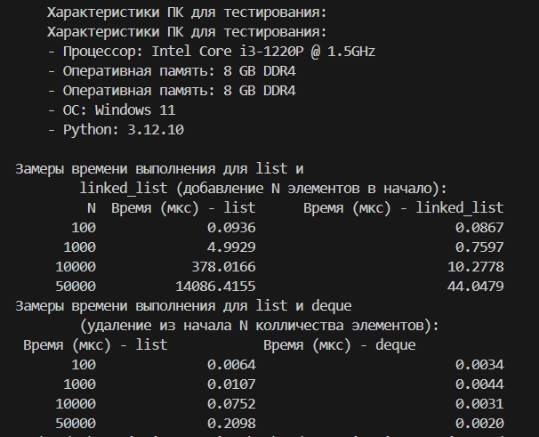
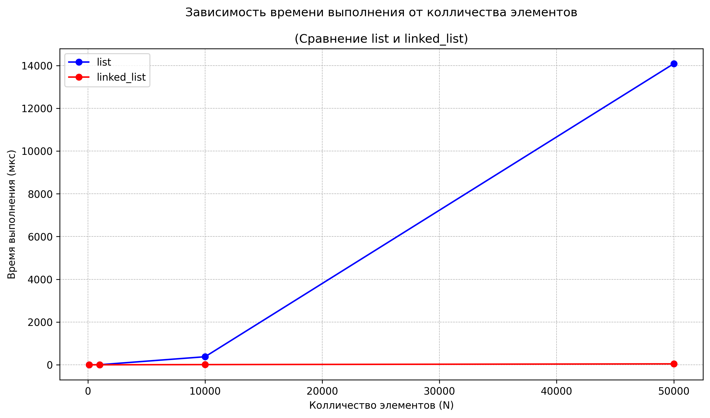
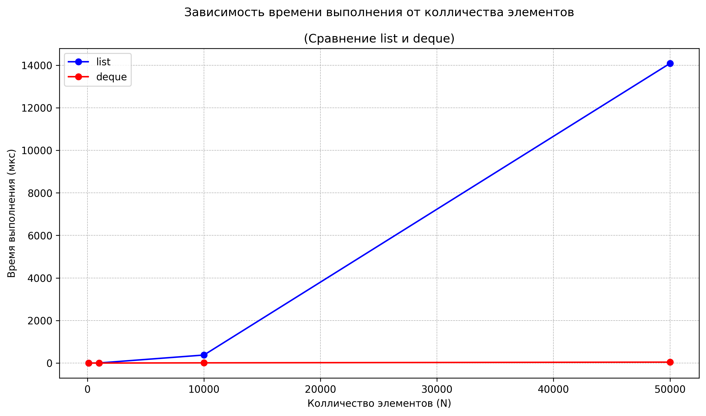
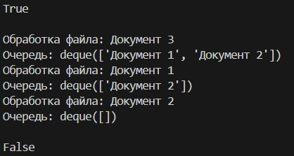

# Отчёт к лабораторной работе 2
# Основные структуры данных
**Дата:** 2025-10-09

**Семестр:** 3 курс 5 семестр

**Группа:** ПИЖ-б-о-23-2(1) 

**Дисциплина:** Анализ сложности алгоритмов 

**Студент:** Торубаров Максим Евгеньевич

## Цель работы
Изучить понятие и особенности базовых абстрактных типов данных (стек, очередь, дек, связный список) и их реализаций в Python. Научиться выбирать оптимальную структуру данных для решения конкретной задачи, основываясь на анализе теоретической и практической сложности операций. Получить навыки измерения производительности и применения структур данных для решения практических задач.

## Практическая часть
### Выполненные задачи
* Задача 1: Реализовать класс LinkedList (связный список) для демонстрации принципов его работы.
* Задача 2: Используя встроенные типы данных (list, collections.deque), проанализировать эффективность операций, имитирующих поведение стека, очереди и дека.
* Задача 3: Провести сравнительный анализ производительности операций для разных структур данных (list vs LinkedList для вставки, list vs deque для очереди).
* Задача 4: Решить 2-3 практические задачи, выбрав оптимальную структуру данных.
### Листинг кода
```python
#linked_list.py
class Node:
    """Класс узла для связного списка.

    Attributes:
        value: Значение, хранящееся в узле.
        next: Ссылка на следующий узел в списке.
    """

    def __init__(self, value):
        self.value = value
        self.next = None


class LinkedList:
    """Реализация односвязного списка.

    Attributes:
        head: Первый элемент списка.
        tail: Последний элемент списка.
    """

    def __init__(self):
        self.head = None
        self.tail = None

    def is_empty(self) -> bool:
        """Проверяет, пуст ли список.

        Returns:
            bool: True, если список пуст, иначе False.
        """
        return self.head is None

    def insert_at_start(self, value):
        """Добавляет новый узел в начало списка.

        Args:
            value: Значение для нового узла.
        """
        new_node = Node(value)

        if self.is_empty():
            self.head = new_node  # O(1)
            self.tail = new_node  # O(1)
        else:
            new_node.next = self.head  # O(1)
            self.head = new_node  # O(1)
        # Общая сложность: O(1)

    def insert_at_end(self, value):
        """Добавляет новый узел в конец списка.

        Args:
            value: Значение для нового узла.
        """
        new_node = Node(value)

        if self.is_empty():
            self.head = new_node  # O(1)
            self.tail = new_node  # O(1)
        else:
            self.tail.next = new_node  # O(n)
            self.tail = new_node  # O(1)
        # Общая сложность: O(n)

    def delete_from_start(self):
        """Удаляет первый элемент списка.

        Returns:
            any: Значение удалённого элемента или None, если список пуст.
        """
        if self.is_empty():
            return None  # O(1)
        else:
            deleted_value = self.head.value  # O(1)
            self.head = self.head.next  # O(1)
            return deleted_value
        # Общая сложность: O(1)

    def traversal(self):
        """Проходит по всем элементам списка и выводит их значения."""
        if self.is_empty():
            print("Список пуст")
            return

        current_node = self.head  # O(1)
        while current_node:  # O(n)
            print(current_node.value)  # O(1)
            current_node = current_node.next  # O(1)
        # Общая сложность: O(n)
```
```py
#perfomance_analysis.py
from .linked_list import LinkedList
import timeit
import random
import collections
import matplotlib.pyplot as plt


# Функция для добавления элементов в начало списка
def list_prepend(list, size):
    for i in range(size):  # O(n)
        list.insert(0, random.randint(0, 1000))  # O(n)
    # Общая сложность: O(n^2)


def linked_list_prepend(linked_list, size):
    for i in range(size):  # O(n)
        linked_list.insert_at_start(random.randint(0, 1000))  # O(1)
    # Общая сложность: O(n)


def comparision(sizes):
    # Характеристики ПК
    pc_info = """
    Характеристики ПК для тестирования:
    - Процессор: Intel Core i3-1220P @ 1.5GHz
    - Оперативная память: 8 GB DDR4
    - ОС: Windows 11
    - Python: 3.12.10
    """
    print(pc_info)

    list = []
    linked_list = LinkedList()
    times_list_insert = []
    times_linked_list_insert = []
    times_list_pop = []
    times_deque_pop = []

    print(
        """Замеры времени выполнения для list и
        linked_list (добавление N элементов в начало):"""
    )
    print(
        "{:>10} {:>19} {:>30}".format(
            "N", "Время (мкс) - list", "Время (мкс) - linked_list"
        )
    )

    # Замеры времени выполнения при сравнении list и linked_list
    for size in sizes:
        time_1 = timeit.timeit(
            lambda: list_prepend(list, size), number=10) * 1000 / 10
        times_list_insert.append(time_1)
        time_2 = (
            timeit.timeit(
                lambda: linked_list_prepend(linked_list, size), number=10)
            * 1000
            / 10
        )
        times_linked_list_insert.append(time_2)
        print(f"{size:>10} {time_1:>19.4f} {time_2:>30.4f}")

    print(
        """Замеры времени выполнения для list и deque
        (удаление из начала N колличества элементов):"""
    )
    print("{:>19} {:>30}".format("Время (мкс) - list", "Время (мкс) - deque"))

    deque = collections.deque()
    # Замеры времени выполнения при сравнении list и deque
    for size in sizes:
        list = []
        for i in range(size):  # Заполнение списка
            deque.appendleft(random.randint(0, size))
            list.append(random.randint(0, size))

        time_1 = timeit.timeit(lambda: list.pop(0), number=1) * 1000
        times_list_pop.append(time_1)
        time_2 = timeit.timeit(lambda: deque.popleft(), number=1) * 1000
        times_deque_pop.append(time_2)

        print(f"{size:>10} {time_1:>19.4f} {time_2:>30.4f}")

    # График сравнения list и linked_list
    plt.figure(figsize=(10, 6))
    plt.plot(sizes, times_list_insert, "bo-", label="list")
    plt.plot(sizes, times_linked_list_insert, "ro-", label="linked_list")
    plt.xlabel("Колличество элементов (N)")
    plt.ylabel("Время выполнения (мкс)")
    plt.title(
        """Зависимость времени выполнения от колличества элементов
        \n(Сравнение list и linked_list)"""
    )
    plt.grid(True, which="both", linestyle="--", linewidth=0.5)
    plt.legend()
    plt.tight_layout()
    plt.savefig(
        "time_complexity_plot_linked.png", dpi=300, bbox_inches="tight")
    plt.show()

    # График сравнения list и deque
    plt.figure(figsize=(10, 6))
    plt.plot(sizes, times_list_insert, "bo-", label="list")
    plt.plot(sizes, times_linked_list_insert, "ro-", label="deque")
    plt.xlabel("Колличество элементов (N)")
    plt.ylabel("Время выполнения (мкс)")
    plt.title(
        """Зависимость времени выполнения от колличества элементов
        \n(Сравнение list и deque)"""
    )
    plt.grid(True, which="both", linestyle="--", linewidth=0.5)
    plt.legend()
    plt.tight_layout()
    plt.savefig("time_complexity_plot_deque.png", dpi=300, bbox_inches="tight")
    plt.show()
```
```py
# task_solutions.py
from collections import deque


# Задача 1
def is_balanced_brackets(s):
    stack = []
    brackets_map = {")": "(", "}": "{", "]": "["}

    for char in s:  # Обход строки
        if char in brackets_map.values():
            stack.append(char)  # Добавление открывающей скобки в стек
        elif char in brackets_map:
            # Проверка соответствия закрывающей скобки
            if not stack or stack[-1] != brackets_map[char]:
                return False
            stack.pop()  # Удаление соответствующей открывающей скобки

    return len(stack) == 0


# Задача 2
def printer(arr):
    queue = deque()

    for el in arr:
        queue.append(el)

    # Обход очереди
    for i in range(len(queue)):
        print(f"Обработка файла: {queue.popleft()}")
        print(f"Очередь: {queue}")


# Задача 3
def is_palindrome(s):
    dq = deque(s)

    while len(dq) > 1:
        # Сравнение крайних элементов и удаление
        if dq.popleft() != dq.pop():
            return False
    return True
```
```py
# main.py
import modules.perfomance_analysis as pa
import modules.task_solutions as ts

if __name__ == "__main__":
    # Анализ производительности
    sizes = [100, 1000, 10000, 50000]
    pa.comparision(sizes)

    # Скобки
    print(ts.is_balanced_brackets("{[()]}"))
    print("")

    # Принтер
    orders = {"Документ 1", "Документ 2", "Документ 3"}
    ts.printer(orders)
    print()

    # Палиндром
    print(ts.is_palindrome("12332"))

```
### Результаты анализа




### Результаты выполнения задач


## Контрольные вопросы
### 1. Отличие динамического массива (list) от связного списка по сложности операций

- **Динамический массив (`list` в Python)** хранит элементы в **непрерывной области памяти**.  
  - Вставка в начало требует **сдвига всех элементов**, поэтому имеет сложность **O(n)**.  
  - Доступ по индексу выполняется за **O(1)**, так как элемент можно найти по адресу.  

- **Связный список** хранит элементы в **узлах**, связанных ссылками.  
  - Вставка в начало — просто изменение одной ссылки, сложность **O(1)**.  
  - Доступ по индексу требует последовательного обхода, сложность **O(n)**.

---

### 2. Принцип работы стека и очереди с примерами

- **Стек (LIFO — Last In, First Out)**: последний добавленный элемент извлекается первым.  
  **Примеры использования:**
  1. Реализация механизма *undo/redo* в редакторах.
  2. Обход дерева в глубину (DFS).

- **Очередь (FIFO — First In, First Out)**: первый добавленный элемент извлекается первым.  
  **Примеры использования:**
  1. Планирование задач в операционной системе.  
  2. Обработка запросов в принтере или веб-сервере.

---

### 3. Почему `list.pop(0)` — O(n), а `deque.popleft()` — O(1)

- В `list` элементы хранятся подряд в памяти. При удалении первого элемента все остальные **сдвигаются на одну позицию**, что требует **O(n)** времени.  
- В `deque` элементы хранятся в **двухсторонней очереди**, где есть ссылки на начало и конец. Удаление первого элемента лишь изменяет ссылку, без сдвига, поэтому выполняется за **O(1)**.

---

### 4. Какая структура данных подходит для системы "отмены действий" (undo)

Наилучший выбор — **стек (LIFO)**.  
Каждое новое действие помещается на вершину стека. При выполнении "Отмены" извлекается последнее действие, которое было выполнено последним — это идеально соответствует принципу LIFO.  
Для функции *повтора (redo)* можно использовать второй стек.

---

### 5. Почему вставка в начало списка медленнее, чем в связный список

- У **списка (list)** вставка в начало требует **сдвига всех элементов вправо**, что даёт сложность **O(n)**.  
- У **связного списка** вставка в начало — это просто добавление нового узла и изменение одной ссылки (**O(1)**).  

Поэтому при вставке 1000 элементов в начало список тратит значительно больше времени, чем связный список, что и подтверждает теоретическую асимптотику.