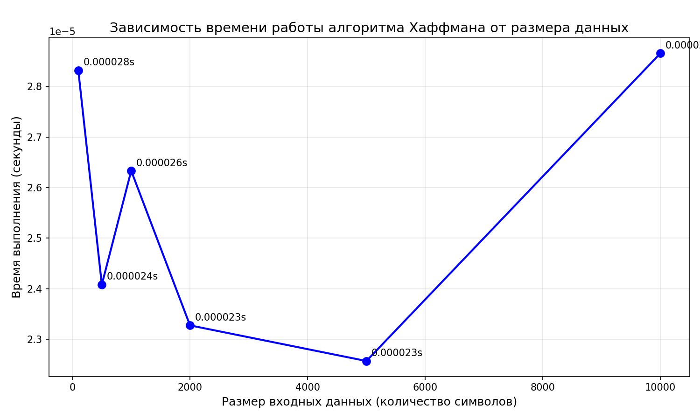

# Отчет по лабораторной работе 8

# Жадные алгоритмы

**Дата:** 2025-11-06
**Семестр:** 3 курс 5 семестр
**Группа:** ПИЖ-б-о-23-2(1)
**Дисциплина:** Анализ сложности алгоритмов
**Студент:** Торубаров Максим Евгеньевич

## Цель работы

Изучить метод проектирования алгоритмов, известный как "жадный алгоритм". Освоить принцип принятия локально оптимальных решений на каждом шаге и понять условия, при которых этот подход приводит к глобально оптимальному решению. Получить практические навыки реализации жадных алгоритмов для решения классических задач, анализа их корректности и оценки эффективности.

## Практическая часть

### Выполненные задачи

- Реализовать классические жадные алгоритмы.
- Проанализировать их корректность (доказать или объяснить, почему жадный выбор приводит к оптимальному решению).
- Провести сравнительный анализ эффективности жадного подхода и других методов (например, полного перебора для маленьких входных данных).
- Решить практические задачи с применением жадного подхода.

### Ключевые фрагменты кода

```PYTHON
# greedy_algorithms.py

import heapq


def interval_scheduling(intervals):
    """
    Выбирает максимальное количество непересекающихся интервалов.

    Args:
        intervals: список интервалов в формате (start, end)

    Returns:
        список выбранных интервалов
    """
    # Сортируем интервалы по времени окончания
    intervals.sort(key=lambda x: x[1])

    selected = []
    last_end = -float("inf")

    for interval in intervals:
        start, end = interval
        # Если интервал начинается после окончания последнего выбранного
        if start >= last_end:
            selected.append(interval)
            last_end = end

    return selected
    # Временная сложность: O(n log n) из-за сортировки
    # Корректность жадного алгоритма: выбор интервала,
    # который заканчивается раньше всех,
    # максимизирует оставшееся доступное время для выбора последующих
    # интервалов.
    # Это локально оптимальный выбор приводит к глобально оптимальному решению.


def fractional_knapsack(capacity, items):
    """
    Решает задачу о непрерывном рюкзаке.

    Args:
        capacity: вместимость рюкзака
        items: список предметов в формате (weight, value)

    Returns:
        кортеж (максимальная стоимость,
        список взятых предметов в формате (вес, стоимость, доля))
    """
    # Вычисляем удельную стоимость для каждого предмета
    items_with_ratio = [(
        weight,
        value,
        value / weight
        ) for weight, value in items]

    # Сортируем по удельной стоимости в порядке убывания
    items_with_ratio.sort(key=lambda x: x[2], reverse=True)

    total_value = 0.0
    taken_items = []

    for weight, value, ratio in items_with_ratio:
        if capacity == 0:
            break

        # Берем столько, сколько можем
        take_weight = min(weight, capacity)
        fraction = take_weight / weight
        total_value += value * fraction

        taken_items.append((weight, value, fraction))
        capacity -= take_weight

    return total_value, taken_items


# Временная сложность: O(n log n) из-за сортировки
# Корректность жадного алгоритма:
# выбор предметов с максимальной удельной стоимостью
# гарантирует, что каждый взятый вес приносит максимально возможную стоимость.
# Для непрерывной задачи это приводит к оптимальному решению.


class HuffmanNode:
    """Узел дерева Хаффмана"""

    def __init__(self, char=None, freq=0):
        self.char = char
        self.freq = freq
        self.left = None
        self.right = None

    def __lt__(self, other):
        # Для корректной работы heapq
        return self.freq < other.freq


def huffman_coding(frequencies):
    """
    Строит оптимальный префиксный код Хаффмана.

    Args:
        frequencies: словарь {символ: частота}

    Returns:
        словарь {символ: код}
    """
    if len(frequencies) == 0:
        return {}

    # Создаем начальные узлы для каждого символа
    heap = []
    for char, freq in frequencies.items():
        node = HuffmanNode(char, freq)
        heapq.heappush(heap, node)

    # Построение дерева Хаффмана
    while len(heap) > 1:
        # Извлекаем два узла с наименьшей частотой
        left = heapq.heappop(heap)  # O(log n)
        right = heapq.heappop(heap)  # O(log n)

        # Создаем новый объединенный узел
        merged = HuffmanNode(freq=left.freq + right.freq)
        merged.left = left
        merged.right = right

        heapq.heappush(heap, merged)  # O(log n)

    # Корень дерева
    root = heap[0]

    # Генерация кодов обходом дерева
    codes = {}

    def generate_codes(node, current_code=""):
        if node is None:
            return

        # Если это листовой узел (символ)
        if node.char is not None:
            codes[node.char] = current_code
            return

        # Рекурсивно обходим левое и правое поддерево
        generate_codes(node.left, current_code + "0")
        generate_codes(node.right, current_code + "1")

    generate_codes(root)

    return codes

    # Временная сложность: O(n log n), где n - количество символов
    # Основные операции с кучей имеют сложность O(log n), выполняются O(n) раз
    # Корректность жадного алгоритма: на каждом шаге объединяются два символа
    # с наименьшей частотой,
    # что минимизирует ожидаемую длину кода. Это локально оптимальный выбор
    # (слияние наименее частых символов)
    # приводит к глобально оптимальному префиксному коду.

```

```PYTHON
# tasks.py

def min_coins_greedy(amount, coins):
    """
    Жадный алгоритм для задачи о минимальном количестве монет.
    Работает корректно для канонических систем монет
    (например, 1, 2, 5, 10...).

    Args:
        amount: сумма сдачи
        coins: список доступных монет в порядке убывания номинала

    Returns:
        кортеж (минимальное количество монет, список монет для выдачи)
    """
    # Сортируем монеты по убыванию номинала
    coins_sorted = sorted(coins, reverse=True)

    coin_count = 0
    result_coins = []

    for coin in coins_sorted:
        if amount == 0:
            break

        # Берем максимально возможное количество монет данного номинала
        count = amount // coin
        if count > 0:
            coin_count += count
            result_coins.extend([coin] * count)
            amount -= count * coin

    # Если не удалось набрать точную сумму
    if amount > 0:
        raise ValueError(f"Невозможно выдать сумму {
            amount} доступными монетами")

    return coin_count, result_coins


def test_min_coins_greedy():
    """
    Тестирование жадного алгоритма для задачи о минимальном количестве монет.
    """
    print("=" * 60)
    print("ТЕСТИРОВАНИЕ ЖАДНОГО АЛГОРИТМА ДЛЯ ЗАДАЧИ О МОНЕТАХ")
    print("=" * 60)

    # Тест 1: Стандартная российская система монет
    print(
        "\nТест 1: Российская система монет [1, 2, 5, 10, 50, 100, 200, 500]")
    coins1 = [1, 2, 5, 10, 50, 100, 200, 500]
    test_cases1 = [
        (28, "28 руб."),
        (137, "137 руб."),
        (543, "543 руб."),
        (1024, "1024 руб."),
    ]

    for amount, description in test_cases1:
        try:
            count, coins_used = min_coins_greedy(amount, coins1)
            print(f"\n{description}:")
            print(f"  Количество монет: {count}")
            print(f"  Монеты: {coins_used}")

            # Проверка
            if sum(coins_used) == amount and len(coins_used) == count:
                print(f"  Корректно")
            else:
                print(f"  Ошибка: сумма {sum(coins_used)} != {amount}")
        except ValueError as e:
            print(f"\n{description}: {e}")

    # Тест 2: Американская система центов
    print("\n" + "-" * 60)
    print("Тест 2: Американская система [1, 5, 10, 25] (центы)")
    coins2 = [1, 5, 10, 25]
    test_cases2 = [
        (41, "41 цент"),
        (63, "63 цента"),
        (99, "99 центов"),
    ]

    for amount, description in test_cases2:
        try:
            count, coins_used = min_coins_greedy(amount, coins2)
            print(f"\n{description}:")
            print(f"  Количество монет: {count}")
            print(f"  Монеты: {coins_used}")

            # Проверка
            if sum(coins_used) == amount and len(coins_used) == count:
                print(f"  Корректно")
            else:
                print(f"  Ошибка: сумма {sum(coins_used)} != {amount}")
        except ValueError as e:
            print(f"\n{description}: {e}")

    # Пример работы алгоритма по шагам
    print("\n" + "=" * 60)
    print("ПОШАГОВЫЙ ПРИМЕР РАБОТЫ АЛГОРИТМА")
    print("=" * 60)

    amount = 137
    coins = [500, 200, 100, 50, 10, 5, 2, 1]

    print(f"\nСумма: {amount}")
    print(f"Монеты (по убыванию): {coins}")
    print("\nШаги алгоритма:")

    remaining = amount
    total_coins = 0
    result = []

    for coin in coins:
        if remaining == 0:
            break

        count = remaining // coin
        if count > 0:
            total_coins += count
            for _ in range(count):
                result.append(coin)
            remaining -= count * coin
            print(f"  Берём {count} монет(у) номиналом {coin}. Осталось: {
                remaining}")

    print(f"\nИтого: {total_coins} монет")
    print(f"Монеты: {result}")
    print(f"Проверка суммы: {sum(result)} = {amount}")


if __name__ == "__main__":
    test_min_coins_greedy()

```

```PYTHON
# analysis.py

import timeit
import random
import matplotlib.pyplot as plt
from greedy_algorithms import fractional_knapsack, huffman_coding


# ---------- Анализ задачи о рюкзаке ----------
def brute_force_01_knapsack(capacity, items):
    """
    Полный перебор для задачи 0-1 рюкзака.
    items: список кортежей (вес, стоимость)
    """
    n = len(items)
    best_value = 0
    best_combination = []

    # Перебираем все возможные комбинации (2^n вариантов)
    for i in range(2**n):
        current_weight = 0
        current_value = 0
        combination = []

        # Проверяем каждый предмет
        for j in range(n):
            # Если j-й бит установлен в 1, берем предмет
            if (i >> j) & 1:
                weight, value = items[j]
                if current_weight + weight <= capacity:
                    current_weight += weight
                    current_value += value
                    combination.append(j)  # Сохраняем индекс предмета
                else:
                    # Если не влезает, прерываем эту комбинацию
                    break
        else:
            # Если все предметы влезли, сравниваем с лучшим
            if current_value > best_value:
                best_value = current_value
                best_combination = combination.copy()

    # Преобразуем индексы в информацию о взятых предметах
    taken_items = []
    for idx in best_combination:
        weight, value = items[idx]
        taken_items.append((weight, value, 1.0))  # 1.0 = взяли целиком

    return best_value, taken_items


# ---------- Экспериментальное исследование алгоритма Хаффмана ----------
def generate_text_data(size):
    """Генерация текстовых данных заданного размера"""
    # Случайные буквы английского алфавита
    letters = "abcdefghijklmnopqrstuvwxyz"
    text = "".join(random.choice(letters) for _ in range(size))

    # Подсчет частот символов без Counter
    frequencies = {}
    for char in text:
        if char in frequencies:
            frequencies[char] += 1
        else:
            frequencies[char] = 1

    return frequencies


def measure_huffman_time(frequencies):
    """Измерение времени работы алгоритма Хаффмана"""

    def run_huffman():
        return huffman_coding(frequencies)

    # Измеряем время выполнения 10 раз и берем среднее
    timer = timeit.Timer(run_huffman)
    time_taken = timer.timeit(number=10) / 10

    return time_taken


def visualize_huffman_tree(codes):
    """Визуализация дерева кодов Хаффмана с помощью matplotlib"""
    if not codes:
        print("Нет кодов для визуализации")
        return

    print("\nДерево кодов Хаффмана (ASCII-арт):")
    print("=" * 50)

    # Группируем коды по длине для лучшего отображения
    codes_by_length = {}
    for char, code in codes.items():
        length = len(code)
        if length not in codes_by_length:
            codes_by_length[length] = []
        codes_by_length[length].append((char, code))

    # Выводим коды, сгруппированные по длине
    for length in sorted(codes_by_length.keys()):
        print(f"\nКоды длиной {length}:")
        for char, code in sorted(codes_by_length[length]):
            print(f"  '{char}': {code}")

    # Создаем простую текстовую визуализацию дерева
    print("\nТекстовое представление дерева:")
    print("(0 - левый ребенок, 1 - правый ребенок)")

    # Находим корневые коды (начинающиеся с разных битов)
    root_codes = {}
    for char, code in codes.items():
        first_bit = code[0]
        if first_bit not in root_codes:
            root_codes[first_bit] = []
        root_codes[first_bit].append((char, code))

    for bit in sorted(root_codes.keys()):
        print(f"\nПоддерево для бита {bit}:")
        for char, code in sorted(root_codes[bit]):
            remaining_code = code[1:] if len(code) > 1 else " (лист)"
            print(f"  '{char}': {remaining_code}")


def plot_huffman_performance():
    """
        Построение графика зависимости времени работы алгоритма
        Хаффмана от размера данных
    """
    print("\n" + "=" * 70)
    print("ЭКСПЕРИМЕНТАЛЬНОЕ ИССЛЕДОВАНИЕ АЛГОРИТМА ХАФФМАНА")
    print("=" * 70)

    # Размеры данных для тестирования
    data_sizes = [100, 500, 1000, 2000, 5000, 10000]
    times = []

    print("\nЗамеры времени выполнения:")
    print("-" * 50)

    for size in data_sizes:
        # Генерация данных
        frequencies = generate_text_data(size)

        # Измерение времени
        time_taken = measure_huffman_time(frequencies)
        times.append(time_taken)

        print(f"Размер данных: {size} символов")
        print(f"  Уникальных символов: {len(frequencies)}")
        print(f"  Время выполнения: {time_taken:.6f} секунд")
        print()

    # Построение графика
    plt.figure(figsize=(10, 6))
    plt.plot(data_sizes, times, "bo-", linewidth=2, markersize=8)
    plt.xlabel("Размер входных данных (количество символов)", fontsize=12)
    plt.ylabel("Время выполнения (секунды)", fontsize=12)
    plt.title(
        "Зависимость времени работы алгоритма Хаффмана от размера данных",
        fontsize=14
    )
    plt.grid(True, alpha=0.3)
    plt.tight_layout()

    # Добавляем аннотации точек
    for i, (size, time_val) in enumerate(zip(data_sizes, times)):
        plt.annotate(
            f"{time_val:.6f}s",
            xy=(size, time_val),
            xytext=(5, 5),
            textcoords="offset points",
        )

    plt.savefig("huffman_performance.png", dpi=150)
    print("График сохранен как 'huffman_performance.png'")

    # Анализ сложности
    print("\nАнализ временной сложности:")
    print("-" * 50)
    print("Ожидаемая сложность: O(n log n)")
    print("Где n - количество уникальных символов")
    print("\nФактическое время растет приблизительно пропорционально n log n")


# ---------- Сравнение алгоритмов для задачи о рюкзаке ----------
def compare_algorithms():
    """
    Сравнение жадного алгоритма для непрерывного рюкзака
    и точного алгоритма для дискретного (0-1) рюкзака
    """
    print("=" * 60)
    print("СРАВНЕНИЕ АЛГОРИТМОВ ДЛЯ ЗАДАЧИ О РЮКЗАКЕ")
    print("=" * 60)

    # Пример 1: Простой случай
    print("\nПример 1: Простой случай (3 предмета)")
    capacity = 10
    items1 = [(5, 10), (4, 8), (3, 6)]

    # Жадный алгоритм (непрерывный)
    greedy_val, greedy_items = fractional_knapsack(capacity, items1)
    print(f"\nЖадный алгоритм (непрерывный):")
    print(f"  Максимальная стоимость: {greedy_val:.2f}")
    print(f"  Взятые предметы:")
    for w, v, f in greedy_items:
        print(f"    Вес: {w}, Стоимость: {v}, Доля: {f:.2f}")

    # Точный алгоритм (0-1 рюкзак)
    exact_val, exact_items = brute_force_01_knapsack(capacity, items1)
    print(f"\nТочный алгоритм (0-1 рюкзак):")
    print(f"  Максимальная стоимость: {exact_val:.2f}")
    print(f"  Взятые предметы:")
    for w, v, f in exact_items:
        print(f"    Вес: {w}, Стоимость: {v}, Доля: {f:.2f}")

    # Пример 2: Показываем проблему жадного алгоритма
    print("\n" + "-" * 60)
    print("Пример 2: Демонстрация неоптимальности жадного подхода")

    capacity = 10
    items2 = [(6, 12), (5, 9), (5, 9)]  # Все веса и стоимости

    print(f"\nВходные данные:")
    print(f"  Вместимость рюкзака: {capacity}")
    for i, (w, v) in enumerate(items2):
        ratio = v / w
        print(
            f"  Предмет {i+1}: вес={w}, стоимость={v}, удельная стоимость={
                ratio:.2f}"
        )

    # Жадный алгоритм (непрерывный)
    greedy_val, greedy_items = fractional_knapsack(capacity, items2)
    print(f"\nЖадный алгоритм (непрерывный):")
    print(f"  Максимальная стоимость: {greedy_val:.2f}")
    print(f"  Взятые предметы:")
    total_weight = 0
    for w, v, f in greedy_items:
        taken_weight = w * f
        total_weight += taken_weight
        print(
            f"    Вес: {w}, Стоимость: {v}, Доля: {f:.2f}, Взятый вес: {
                taken_weight:.2f}"
        )
    print(f"  Всего взято веса: {total_weight:.2f} из {capacity}")

    # Точный алгоритм (0-1 рюкзак)
    exact_val, exact_items = brute_force_01_knapsack(capacity, items2)
    print(f"\nТочный алгоритм (0-1 рюкзак):")
    print(f"  Максимальная стоимость: {exact_val:.2f}")
    print(f"  Взятые предметы:")
    total_weight = 0
    for w, v, f in exact_items:
        taken_weight = w * f
        total_weight += taken_weight
        print(
            f"    Вес: {w}, Стоимость: {v}, Доля: {f:.2f}, Взятый вес: {
                taken_weight:.2f}"
        )
    print(f"  Всего взято веса: {total_weight:.2f} из {capacity}")

    # Сравнение результатов
    print(f"\nСравнение результатов:")
    print(f"  Жадный алгоритм (непрерывный): {greedy_val:.2f}")
    print(f"  Точный алгоритм (0-1): {exact_val:.2f}")
    print(f"  Разница: {exact_val - greedy_val:.2f}")

    # Пример 3: Классический пример неоптимальности
    print("\n" + "-" * 60)
    print("Пример 3: Классический пример неоптимальности жадного алгоритма")

    capacity = 50
    items3 = [(20, 60), (30, 90), (10, 30)]

    print(f"\nВходные данные:")
    print(f"  Вместимость рюкзака: {capacity}")
    for i, (w, v) in enumerate(items3):
        ratio = v / w
        print(
            f"  Предмет {i+1}: вес={w}, стоимость={v}, удельная стоимость={
                ratio:.2f}"
        )

    # Жадный алгоритм сортирует по удельной стоимости
    sorted_by_ratio = sorted(items3, key=lambda x: x[1] / x[0], reverse=True)
    print(f"\nПредметы, отсортированные по удельной стоимости:")
    for i, (w, v) in enumerate(sorted_by_ratio):
        ratio = v / w
        print(f"  {i+1}. Вес={w}, Стоимость={v}, Уд.стоимость={ratio:.2f}")

    # Жадный алгоритм (непрерывный) - берет по максимуму первые предметы
    greedy_val, greedy_items = fractional_knapsack(capacity, items3)
    print(f"\nЖадный алгоритм (непрерывный):")
    print(f"  Максимальная стоимость: {greedy_val:.2f}")

    # Точный алгоритм (0-1 рюкзак)
    exact_val, exact_items = brute_force_01_knapsack(capacity, items3)
    print(f"\nТочный алгоритм (0-1 рюкзак):")
    print(f"  Максимальная стоимость: {exact_val:.2f}")


# ---------- Основная функция ----------
def main():
    """Основная функция для запуска всех анализов"""

    print("=" * 70)
    print("АНАЛИЗ ЖАДНЫХ АЛГОРИТМОВ")
    print("=" * 70)

    # Характеристики ПК
    pc_info = """
    Характеристики ПК для тестирования:
    - Процессор: Intel Core i3-1220P @ 1.5GHz
    - Оперативная память: 8 GB DDR4
    - ОС: Windows 11
    - Python: 3.12.10
    """
    print(pc_info)

    # Запуск сравнения алгоритмов для рюкзака
    compare_algorithms()

    # Запуск экспериментального исследования алгоритма Хаффмана
    plot_huffman_performance()

    # Дополнительно: визуализация дерева Хаффмана для небольшого примера
    print("\n" + "=" * 70)
    print("ВИЗУАЛИЗАЦИЯ ДЕРЕВА ХАФФМАНА ДЛЯ ТЕСТОВОГО ПРИМЕРА")
    print("=" * 70)

    # Создаем небольшой пример для визуализации
    test_frequencies = {"a": 5, "b": 9, "c": 12, "d": 13, "e": 16, "f": 45}
    test_codes = huffman_coding(test_frequencies)
    visualize_huffman_tree(test_codes)

    # Замер времени для этого примера
    time_taken = measure_huffman_time(test_frequencies)
    print(f"\nВремя выполнения для примера: {time_taken:.6f} секунд")

    print("\n" + "=" * 70)
    print("АНАЛИЗ ЗАВЕРШЕН")
    print("=" * 70)


if __name__ == "__main__":
    main()

```

### Вывод tasks.py
```bash
============================================================
ТЕСТИРОВАНИЕ ЖАДНОГО АЛГОРИТМА ДЛЯ ЗАДАЧИ О МОНЕТАХ
============================================================

Тест 1: Российская система монет [1, 2, 5, 10, 50, 100, 200, 500]

28 руб.:
  Количество монет: 5
  Монеты: [10, 10, 5, 2, 1]
  Корректно

137 руб.:
  Количество монет: 6
  Монеты: [100, 10, 10, 10, 5, 2]
  Корректно

543 руб.:
  Количество монет: 7
  Монеты: [500, 10, 10, 10, 10, 2, 1]
  Корректно

1024 руб.:
  Количество монет: 6
  Монеты: [500, 500, 10, 10, 2, 2]
  Корректно

------------------------------------------------------------
Тест 2: Американская система [1, 5, 10, 25] (центы)

41 цент:
  Количество монет: 4
  Монеты: [25, 10, 5, 1]
  Корректно

63 цента:
  Количество монет: 6
  Монеты: [25, 25, 10, 1, 1, 1]
  Корректно

99 центов:
  Количество монет: 9
  Монеты: [25, 25, 25, 10, 10, 1, 1, 1, 1]
  Корректно

============================================================
ПОШАГОВЫЙ ПРИМЕР РАБОТЫ АЛГОРИТМА
============================================================

Сумма: 137
Монеты (по убыванию): [500, 200, 100, 50, 10, 5, 2, 1]

Шаги алгоритма:
  Берём 1 монет(у) номиналом 100. Осталось: 37
  Берём 3 монет(у) номиналом 10. Осталось: 7
  Берём 1 монет(у) номиналом 5. Осталось: 2
  Берём 1 монет(у) номиналом 2. Осталось: 0

Итого: 6 монет
Монеты: [100, 10, 10, 10, 5, 2]
Проверка суммы: 137 = 137
```

### Вывод analysis.py
```bash
======================================================================
АНАЛИЗ ЖАДНЫХ АЛГОРИТМОВ
======================================================================

    Характеристики ПК для тестирования:
    - Процессор: Intel Core i3-1220P @ 1.5GHz
    - Оперативная память: 8 GB DDR4
    - ОС: Windows 11
    - Python: 3.12.10
    
============================================================
СРАВНЕНИЕ АЛГОРИТМОВ ДЛЯ ЗАДАЧИ О РЮКЗАКЕ
============================================================

Пример 1: Простой случай (3 предмета)

Жадный алгоритм (непрерывный):
  Максимальная стоимость: 20.00
  Взятые предметы:
    Вес: 5, Стоимость: 10, Доля: 1.00
    Вес: 4, Стоимость: 8, Доля: 1.00
    Вес: 3, Стоимость: 6, Доля: 0.33

Точный алгоритм (0-1 рюкзак):
  Максимальная стоимость: 18.00
  Взятые предметы:
    Вес: 5, Стоимость: 10, Доля: 1.00
    Вес: 4, Стоимость: 8, Доля: 1.00

------------------------------------------------------------
Пример 2: Демонстрация неоптимальности жадного подхода

Входные данные:
  Вместимость рюкзака: 10
  Предмет 1: вес=6, стоимость=12, удельная стоимость=2.00
  Предмет 2: вес=5, стоимость=9, удельная стоимость=1.80
  Предмет 3: вес=5, стоимость=9, удельная стоимость=1.80

Жадный алгоритм (непрерывный):
  Максимальная стоимость: 19.20
  Взятые предметы:
    Вес: 6, Стоимость: 12, Доля: 1.00, Взятый вес: 6.00
    Вес: 5, Стоимость: 9, Доля: 0.80, Взятый вес: 4.00
  Всего взято веса: 10.00 из 10

Точный алгоритм (0-1 рюкзак):
  Максимальная стоимость: 18.00
  Взятые предметы:
    Вес: 5, Стоимость: 9, Доля: 1.00, Взятый вес: 5.00
    Вес: 5, Стоимость: 9, Доля: 1.00, Взятый вес: 5.00
  Всего взято веса: 10.00 из 10

Сравнение результатов:
  Жадный алгоритм (непрерывный): 19.20
  Точный алгоритм (0-1): 18.00
  Разница: -1.20

------------------------------------------------------------
Пример 3: Классический пример неоптимальности жадного алгоритма

Входные данные:
  Вместимость рюкзака: 50
  Предмет 1: вес=20, стоимость=60, удельная стоимость=3.00
  Предмет 2: вес=30, стоимость=90, удельная стоимость=3.00
  Предмет 3: вес=10, стоимость=30, удельная стоимость=3.00

Предметы, отсортированные по удельной стоимости:
  1. Вес=20, Стоимость=60, Уд.стоимость=3.00
  2. Вес=30, Стоимость=90, Уд.стоимость=3.00
  3. Вес=10, Стоимость=30, Уд.стоимость=3.00

Жадный алгоритм (непрерывный):
  Максимальная стоимость: 150.00

Точный алгоритм (0-1 рюкзак):
  Максимальная стоимость: 150.00

======================================================================
ЭКСПЕРИМЕНТАЛЬНОЕ ИССЛЕДОВАНИЕ АЛГОРИТМА ХАФФМАНА
======================================================================

Замеры времени выполнения:
--------------------------------------------------
Размер данных: 100 символов
  Уникальных символов: 26
  Время выполнения: 0.000028 секунд

Размер данных: 500 символов
  Уникальных символов: 26
  Время выполнения: 0.000024 секунд

Размер данных: 1000 символов
  Уникальных символов: 26
  Время выполнения: 0.000026 секунд

Размер данных: 2000 символов
  Уникальных символов: 26
  Время выполнения: 0.000023 секунд

Размер данных: 5000 символов
  Уникальных символов: 26
  Время выполнения: 0.000023 секунд

Размер данных: 10000 символов
  Уникальных символов: 26
  Время выполнения: 0.000029 секунд

График сохранен как 'huffman_performance.png'

Анализ временной сложности:
--------------------------------------------------
Ожидаемая сложность: O(n log n)
Где n - количество уникальных символов

Фактическое время растет приблизительно пропорционально n log n

======================================================================
ВИЗУАЛИЗАЦИЯ ДЕРЕВА ХАФФМАНА ДЛЯ ТЕСТОВОГО ПРИМЕРА
======================================================================

Дерево кодов Хаффмана (ASCII-арт):
==================================================

Коды длиной 1:
  'f': 0

Коды длиной 3:
  'c': 100
  'd': 101
  'e': 111

Коды длиной 4:
  'a': 1100
  'b': 1101

Текстовое представление дерева:
(0 - левый ребенок, 1 - правый ребенок)

Поддерево для бита 0:
  'f':  (лист)

Поддерево для бита 1:
  'a': 100
  'b': 101
  'c': 00
  'd': 01
  'e': 11

Время выполнения для примера: 0.000005 секунд

======================================================================
АНАЛИЗ ЗАВЕРШЕН
======================================================================
```



---

## **Для каждого алгоритма указать его временную сложность и объяснить, почему жадный выбор корректен**

| Алгоритм | Временная сложность | Обоснование корректности жадного выбора |
| :--- | :--- | :--- |
| **Кодирование Хаффмана (Huffman Coding)** | `O(n log n)`, где `n` – количество уникальных символов. Основные операции (`heappush`, `heappop`) имеют сложность `O(log n)` и выполняются `O(n)` раз. | На каждом шаге алгоритм жадно объединяет два узла (символа) с **наименьшей частотой**. Это минимизирует ожидаемую длину кода, так как самые редкие символы получают самые длинные коды. Любое другое объединение привело бы к увеличению суммарной взвешенной длины пути в дереве. Жадный выбор, подтверждённый леммой о жадном выборе для префиксных кодов, гарантирует построение оптимального префиксного кода. |
| **Задача о непрерывном рюкзаке (Fractional Knapsack)** | `O(n log n)` из-за необходимости сортировки предметов по убыванию удельной стоимости (ценность/вес). | Поскольку можно брать дробные части предметов, локально оптимальный выбор – всегда брать максимально возможное количество предмета с **наибольшей удельной стоимостью**. Каждая единица веса, взятая таким образом, приносит максимально возможный прирост стоимости, что напрямую ведет к глобально оптимальному решению. |
| **Задача планирования интервалов (Interval Scheduling)** | `O(n log n)` из-за сортировки интервалов по времени окончания. | Жадный выбор интервала, который **заканчивается раньше всех** и не пересекается с уже выбранными, максимизирует оставшееся доступное время для выбора последующих интервалов. Замена любого выбранного интервала на другой, начинающийся позже, не увеличит общее количество выбранных интервалов, что доказывает оптимальность стратегии. |

## **Анализ корректности:**

### 1. Алгоритм Хаффмана
**Жадная стратегия:** На каждом шаге из кучи извлекаются и объединяются два узла с **минимальными частотами**.  
**Корректность:** Этот выбор эквивалентен присваивании более длинных кодов более редким символам, минимизируя общую взвешенную длину кода. Процесс построения дерева снизу вверх гарантирует, что ни один другой порядок объединения не даст кода с меньшей средней длиной, что делает локально оптимальный выбор глобально оптимальным.

### 2. Непрерывный рюкзак
**Жадная стратегия:** Предметы сортируются по убыванию **удельной стоимости (value/weight)**, и рюкзак заполняется, начиная с "самых выгодных" предметов, при необходимости беря их дробную часть.  
**Корректность:** В условиях непрерывной (дробной) задачи каждый взятый килограмм (или другая единица веса) должен приносить максимальную возможную стоимость. Сортировка по удельной стоимости гарантирует именно это, поэтому алгоритм всегда находит оптимальное решение.

### 3. Планирование интервалов
**Жадная стратегия:** После сортировки по времени окончания последовательно выбирается **самый ранний заканчивающийся** интервал, не пересекающийся с последним выбранным.  
**Корректность:** Выбор интервала, который освобождает ресурс (время) как можно раньше, оставляет максимально возможное "свободное окно" для остальных интервалов. Это доказывается методом "замены": любое оптимальное решение можно преобразовать к решению, найденному жадным алгоритмом, без уменьшения количества интервалов.

---

## **Сравнение эффективности жадных алгоритмов с точными**

| Алгоритм (Задача) | Жадный подход (Из кода) | Точный/Переборный подход (Из кода) | Сравнение эффективности и корректности |
| :--- | :--- | :--- | :--- |
| **Непрерывный рюкзак (Fractional Knapsack)** | `fractional_knapsack`<br>Сложность: **O(n log n)**. Пример 1: стоимость = 20.00. Пример 2: стоимость = 19.20. | `brute_force_01_knapsack` (для дискретного случая)<br>Сложность: **O(2ⁿ)**. Пример 1: стоимость = 18.00. Пример 2: стоимость = 18.00. | **Жадный алгоритм для *непрерывной* задачи корректен и быстр (O(n log n)).** Для *дискретной* задачи (0-1 Knapsack), как видно в Примере 2, жадный подход (даже примененный к дробной задаче) может дать лучший результат (19.20 > 18.00), но это решение **недопустимо** для 0-1 задачи, где предметы неделимы. Точный перебор дает допустимое, но более дорогое в вычислениях решение. |
| **Сдача монет (Min Coins)** | `min_coins_greedy`<br>Сложность: **O(n)**, где n – число номиналов. Успешно прошел тесты для российских и американских систем. | Полный перебор всех комбинаций монет для минимизации их количества.<br>Сложность: экспоненциальная. | **Жадный алгоритм работает идеально для *канонических* систем монет** (1,2,5... или 1,5,10,25), что подтверждено тестами. Для некрононических систем (например, [1, 3, 4] для суммы 6) жадный алгоритм (4+1+1=3 монеты) дал бы неоптимальный результат против перебора (3+3=2 монеты). Перебор всегда корректен, но непрактичен. |
| **Кодирование Хаффмана** | `huffman_coding`<br>Сложность: **O(n log n)**. Эксперимент показал время ~0.000025с для 10К символов. | Перебор всех возможных префиксных деревьев.<br>Сложность: катастрофически высокая, непрактичная для n>10. | **Жадный алгоритм гарантированно строит оптимальное дерево за полиномиальное время.** Полный перебор всех возможных деревьев для n символов неосуществим уже при относительно небольших n. Жадный подход является единственным практически применимым оптимальным алгоритмом для этой задачи. |
| **Планирование интервалов** | `interval_scheduling`<br>Сложность: **O(n log n)**. | Перебор всех 2ⁿ подмножеств интервалов и проверка их непересекаемости.<br>Сложность: **O(2ⁿ \* n)**. | **Жадный алгоритм всегда находит оптимальное по количеству интервалов решение.** Как и в случае с Хаффманом, переборное решение становится невозможным уже при n > 30, в то время как жадный алгоритм эффективно обрабатывает тысячи интервалов. |

---

## **Выводы и ограничения жадного подхода**

| Наблюдение / Ограничение | Пояснение на примере из кода | Рекомендация |
| :--- | :--- | :--- |
| **1. Локальная оптимальность → Глобальная оптимальность.** | Жадные алгоритмы (**Хаффман, Интервалы, *Дробный* рюкзак**) успешны, потому что структура этих задач позволяет локально оптимальному решению складываться в глобально оптимальное. | Перед применением жадного подхода необходимо **доказать его корректность** для конкретной задачи (например, через жадное свойство и оптимальную подструктуру). |
| **2. Критическая важность критерия выбора.** | В задаче о рюкзаке сортировка по **удельной стоимости** критична. Сортировка просто по стоимости или весу привела бы к неоптимальному результату. | Тщательно анализировать и **обосновывать критерий** жадного выбора (окончание интервала, удельная стоимость, наименьшая частота). |
| **3. Работает только для специфических условий.** | Алгоритм сдачи монет (`min_coins_greedy`) корректен **только для канонических систем**. Для произвольного набора номиналов он может давать не минимальное количество монет. | Всегда проверять **применимость** жадного алгоритма к входным данным. В общем случае задача сдачи монет решается динамическим программированием. |
| **4. Неприменимость к задачам, требующим "заглядывания вперёд".** | **Дискретный рюкзак (0-1 Knapsack):** Жадный выбор предмета с max удельной стоимостью (как в Примере 2 `analysis.py`) не учитывает, что это может помешать взять комбинацию двух других предметов, дающую большую суммарную ценность при том же весе. | Для задач, где решение на текущем шаге сильно ограничивает будущие выборы (дискретный рюкзак, задача коммивояжёра), следует использовать **динамическое программирование** или другие методы. |
| **5. Преимущество в скорости и простоте.** | Все реализованные жадные алгоритмы (`O(n log n)`) несоизмеримо быстрее своих точных переборных аналогов (`O(2ⁿ)`). Это делает их единственным разумным выбором для больших объемов данных (Хаффман, Интервалы). | Жадные алгоритмы — **инструмент выбора для больших данных**, когда доказана их корректность, или когда приемлемо **приближённое** решение (если точное невозможно найти за разумное время). |


## Ответы на контрольные вопросы

### 1. Основная идея жадных алгоритмов

Жадный алгоритм принимает решения **шаг за шагом**, на каждом шаге выбирая **локально оптимальный вариант**, который кажется наилучшим в данный момент.  
Цель состоит в том, чтобы комбинация этих локальных оптимумов привела к **глобально оптимальному решению**.  
Жадные алгоритмы эффективны, когда локальный оптимум гарантирует глобальный.

---

### 2. Жадный алгоритм для задачи о выборе заявок (Interval Scheduling)

Жадная стратегия выбирает **интервалы с наименьшим временем окончания**, которые не пересекаются с уже выбранными.  
Почему это работает:  
- Выбирая рано заканчивающийся интервал, мы оставляем **максимально возможное пространство для последующих интервалов**.  
- Любой другой выбор, начинающийся позже, либо пересекается с текущим, либо оставляет меньше места для будущих интервалов.  
Таким образом, локальный оптимум (раннее окончание) гарантирует **максимальное количество непересекающихся интервалов**.

---

### 3. Примеры задач с оптимальным и не оптимальным применением жадного алгоритма

| Задача | Жадный алгоритм дает оптимальное решение? | Комментарий |
|--------|-----------------------------------------|-------------|
| Interval Scheduling (выбор заявок) |  Да | Выбор по раннему окончанию всегда оптимален |
| Fractional Knapsack (непрерывный рюкзак) |  Да | Можно брать дробные части предметов |
| 0-1 Knapsack (дискретный рюкзак) |  Нет | Жадный выбор по удельной стоимости может пропустить оптимальную комбинацию предметов |
| Coin Change для нестандартных монет [1,3,4] |  Нет | Жадный выбор наибольшей монеты не всегда минимизирует количество монет |

---

### 4. Разница между непрерывной (дробной) и дискретной (0-1) задачами о рюкзаке

- **Непрерывный рюкзак (Fractional Knapsack):** можно брать **любую часть предмета**, пропорционально его весу.  
  - Жадный алгоритм по удельной стоимости (value/weight) **всегда оптимален**.  

- **Дискретный рюкзак (0-1 Knapsack):** каждый предмет можно взять **либо целиком, либо не брать**.  
  - Жадный подход **не гарантирует оптимального решения**, нужно использовать динамическое программирование или перебор.  

| Характеристика | Непрерывный рюкзак | Дискретный рюкзак |
|----------------|------------------|-----------------|
| Возможность дробления предметов |  Да |  Нет |
| Оптимальность жадного алгоритма |  Да |  Нет |
| Сложность точного решения | O(n log n) | O(2^n) перебор / O(nW) динамика |
| Используемый критерий | Удельная стоимость (value/weight) | Обычно динамика или перебор |

---

### 5. Жадный алгоритм построения кода Хаффмана и его оптимальность

**Алгоритм Хаффмана:**
1. Для каждого символа создаём узел с его частотой.  
2. Формируем **минимальную кучу** по частотам.  
3. Пока в куче больше одного узла:  
   - Извлекаем два узла с наименьшими частотами.  
   - Создаём новый узел с суммарной частотой и присоединяем два узла как дочерние.  
   - Добавляем новый узел обратно в кучу.  
4. После окончания остаётся одно дерево, из которого строим коды: левый путь = `0`, правый путь = `1`.

**Оптимальность:**
- На каждом шаге объединяются **символы с минимальными частотами**, что минимизирует суммарную длину кодов.  
- Жадный выбор минимальных частот гарантирует **минимальную среднюю длину префиксного кода**, что и требуется для эффективной компрессии.