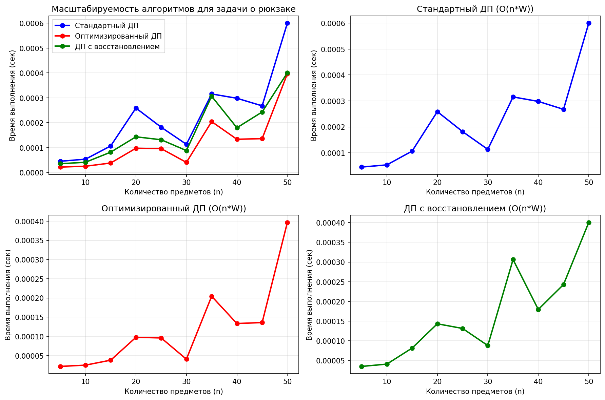
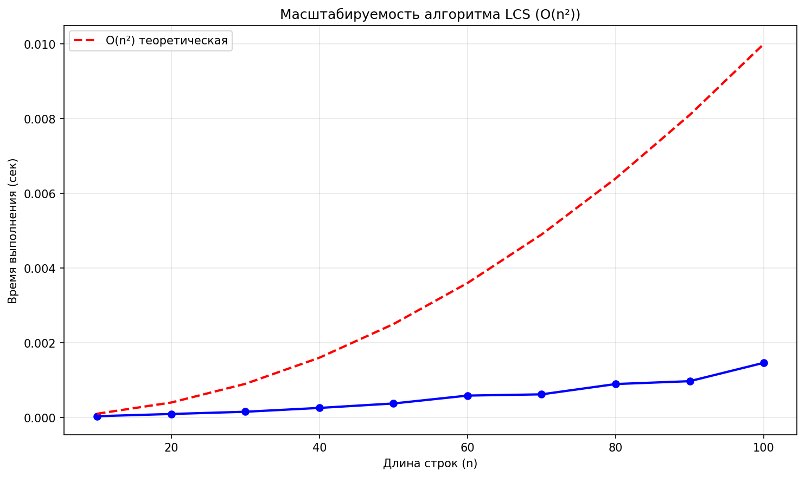
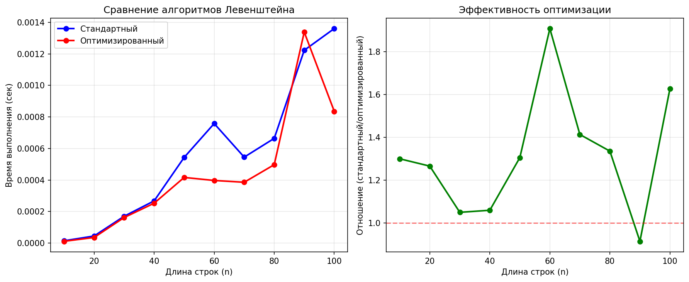

# Отчет по лабораторной работе 9

# Динамическое программирование

**Дата:** 2025-11-06
**Семестр:** 3 курс 5 семестр
**Группа:** ПИЖ-б-о-23-2(1)
**Дисциплина:** Анализ сложности алгоритмов
**Студент:** Торубаров Максим Евгеньевич

## Цель работы

Изучить метод динамического программирования (ДП) как мощный инструмент для решения сложных задач путём их разбиения на перекрывающиеся подзадачи. Освоить два основных подхода к реализации ДП: нисходящий (с мемоизацией) и восходящий (с заполнением таблицы). Получить практические навыки выявления оптимальной подструктуры задач, построения таблиц ДП и анализа временной и пространственной сложности алгоритмов.

## Практическая часть

### Выполненные задачи

- Реализовать классические алгоритмы динамического программирования.
- Реализовать оба подхода (нисходящий и восходящий) для решения задач.
- Провести сравнительный анализ эффективности двух подходов.
- Проанализировать временную и пространственную сложность алгоритмов.
- Решить практические задачи с применением ДП.

### Ключевые фрагменты кода

```PY
# dynamic_programming.py

# ====================== Числа Фибоначчи ======================


def fibonacci_naive(n):
    """Наивная рекурсивная реализация чисел Фибоначчи."""
    if n <= 1:
        return n
    return fibonacci_naive(n - 1) + fibonacci_naive(n - 2)


# Временная сложность: O(2^n) - экспоненциальная
# Пространственная сложность: O(n) - глубина стека вызовов


def fibonacci_memoization(n, memo=None):
    """Рекурсивная реализация чисел Фибоначчи с мемоизацией."""
    if memo is None:
        memo = {}

    if n in memo:
        return memo[n]

    if n <= 1:
        return n

    memo[n] = fibonacci_memoization(
        n - 1, memo) + fibonacci_memoization(n - 2, memo)
    return memo[n]


# Временная сложность: O(n) - линейная
# Пространственная сложность: O(n) - для хранения мемоизированных значений


def fibonacci_tabular(n):
    """Итеративная табличная реализация чисел Фибоначчи."""
    if n <= 1:
        return n

    prev2, prev1 = 0, 1  # F(0), F(1)

    for i in range(2, n + 1):
        current = prev1 + prev2
        prev2, prev1 = prev1, current

    return prev1


# Временная сложность: O(n) - линейная
# Пространственная сложность: O(1) - константная


# ====================== Задача о рюкзаке (0-1 Knapsack) ======================


def knapsack_01(weights, values, capacity):
    """
        Решение задачи о рюкзаке (0-1) с использованием
        динамического программирования.
    """
    n = len(weights)

    # Создаем таблицу dp размером (n+1) x (capacity+1)
    dp = [[0] * (capacity + 1) for _ in range(n + 1)]

    # Заполняем таблицу
    for i in range(1, n + 1):
        for w in range(capacity + 1):
            if weights[i - 1] <= w:
                dp[i][w] = max(
                    dp[i - 1][w], dp[i - 1][w - weights[i - 1]] + values[i - 1]
                )
            else:
                dp[i][w] = dp[i - 1][w]

    # Восстанавливаем выбранные предметы
    selected_items = []
    w = capacity

    for i in range(n, 0, -1):
        if dp[i][w] != dp[i - 1][w]:
            selected_items.append(i - 1)
            w -= weights[i - 1]

    selected_items.reverse()

    return dp[n][capacity], selected_items


# Временная сложность: O(n * W), где n - количество предметов, W - вместимость
# Пространственная сложность: O(n * W) - для таблицы dp


def knapsack_01_optimized(weights, values, capacity):
    """
        Оптимизированное решение задачи о рюкзаке (0-1)
        с использованием 1D массива.
    """
    n = len(weights)
    dp = [0] * (capacity + 1)

    for i in range(n):
        for w in range(capacity, weights[i] - 1, -1):
            dp[w] = max(dp[w], dp[w - weights[i]] + values[i])

    return dp[capacity]


# Временная сложность: O(n * W)
# Пространственная сложность: O(W) - только один массив


def knapsack_01_with_items(weights, values, capacity):
    """
    Решение задачи о рюкзаке (0-1) с восстановлением набора предметов
    и использованием двух массивов для оптимизации памяти.
    """
    n = len(weights)

    # Используем два массива: для предыдущей и текущей строки
    prev = [0] * (capacity + 1)
    curr = [0] * (capacity + 1)

    # Матрица для хранения выбранных предметов
    # selected[i][w] = True, если предмет i включен в решение для веса w
    selected = [[False] * (capacity + 1) for _ in range(n)]

    # Заполняем таблицу
    for i in range(n):
        for w in range(capacity + 1):
            if weights[i] <= w:
                # Вариант 1: не берем текущий предмет
                not_take = prev[w]
                # Вариант 2: берем текущий предмет
                take = prev[w - weights[i]] + values[i]

                if take > not_take:
                    curr[w] = take
                    selected[i][w] = True
                else:
                    curr[w] = not_take
                    selected[i][w] = False
            else:
                curr[w] = prev[w]
                selected[i][w] = False

        # Обновляем массивы для следующей итерации
        prev, curr = curr, [0] * (capacity + 1)

    # Восстанавливаем выбранные предметы
    selected_items = []
    w = capacity

    for i in range(n - 1, -1, -1):
        if selected[i][w]:
            selected_items.append(i)
            w -= weights[i]

    selected_items.reverse()

    return prev[capacity], selected_items


# Временная сложность: O(n * W)
# Пространственная сложность: O(n * W) - для матрицы selected, O(W) для dp


# ====== Наибольшая общая подпоследовательность (LCS) ======


def longest_common_subsequence(str1, str2):
    """Нахождение длины наибольшей общей подпоследовательности (LCS)."""
    m, n = len(str1), len(str2)

    # Создаем таблицу dp размером (m+1) x (n+1)
    dp = [[0] * (n + 1) for _ in range(m + 1)]

    # Заполняем таблицу
    for i in range(1, m + 1):
        for j in range(1, n + 1):
            if str1[i - 1] == str2[j - 1]:
                dp[i][j] = dp[i - 1][j - 1] + 1
            else:
                dp[i][j] = max(dp[i - 1][j], dp[i][j - 1])

    # Восстанавливаем LCS
    lcs = []
    i, j = m, n

    while i > 0 and j > 0:
        if str1[i - 1] == str2[j - 1]:
            lcs.append(str1[i - 1])
            i -= 1
            j -= 1
        elif dp[i - 1][j] > dp[i][j - 1]:
            i -= 1
        else:
            j -= 1

    lcs.reverse()

    return dp[m][n], "".join(lcs)


# Временная сложность: O(m * n), где m и n - длины строк
# Пространственная сложность: O(m * n) - для таблицы dp


def longest_common_subsequence_optimized(str1, str2):
    """Оптимизированная версия LCS с использованием двух строк."""
    m, n = len(str1), len(str2)

    if m < n:
        str1, str2 = str2, str1
        m, n = n, m

    # Используем только два ряда вместо всей таблицы
    prev = [0] * (n + 1)
    curr = [0] * (n + 1)

    for i in range(1, m + 1):
        for j in range(1, n + 1):
            if str1[i - 1] == str2[j - 1]:
                curr[j] = prev[j - 1] + 1
            else:
                curr[j] = max(prev[j], curr[j - 1])
        prev, curr = curr, [0] * (n + 1)

    return prev[n]


# Временная сложность: O(m * n)
# Пространственная сложность: O(min(m, n))


def longest_common_subsequence_with_path(str1, str2):
    """
    Нахождение LCS с восстановлением подпоследовательности
    и использованием дополнительной структуры для хранения пути.
    """
    m, n = len(str1), len(str2)

    # Таблицы для длин и направлений
    dp = [[0] * (n + 1) for _ in range(m + 1)]
    direction = [[0] * (n + 1) for _ in range(m + 1)]

    # Заполняем таблицы
    for i in range(1, m + 1):
        for j in range(1, n + 1):
            if str1[i - 1] == str2[j - 1]:
                dp[i][j] = dp[i - 1][j - 1] + 1
                direction[i][j] = 1  # Диагональ - символы совпали
            else:
                if dp[i - 1][j] >= dp[i][j - 1]:
                    dp[i][j] = dp[i - 1][j]
                    direction[i][j] = 2  # Вверх
                else:
                    dp[i][j] = dp[i][j - 1]
                    direction[i][j] = 3  # Влево

    # Восстанавливаем LCS по направлениям
    lcs = []
    i, j = m, n

    while i > 0 and j > 0:
        if direction[i][j] == 1:  # Диагональ
            lcs.append(str1[i - 1])
            i -= 1
            j -= 1
        elif direction[i][j] == 2:  # Вверх
            i -= 1
        else:  # Влево
            j -= 1

    lcs.reverse()

    return dp[m][n], "".join(lcs)


# Временная сложность: O(m * n)
# Пространственная сложность: O(m * n) - для таблиц dp и direction


# ====================== Расстояние Левенштейна ======================


def levenshtein_distance(str1, str2):
    """Вычисление расстояния Левенштейна (редакционного расстояния)."""
    m, n = len(str1), len(str2)

    # Создаем таблицу dp размером (m+1) x (n+1)
    dp = [[0] * (n + 1) for _ in range(m + 1)]

    # Инициализация: пустая строка
    for i in range(m + 1):
        dp[i][0] = i
    for j in range(n + 1):
        dp[0][j] = j

    # Заполняем таблицу
    for i in range(1, m + 1):
        for j in range(1, n + 1):
            if str1[i - 1] == str2[j - 1]:
                dp[i][j] = dp[i - 1][j - 1]
            else:
                dp[i][j] = min(
                    dp[i - 1][j] + 1,  # удаление
                    dp[i][j - 1] + 1,  # вставка
                    dp[i - 1][j - 1] + 1,  # замена
                )

    return dp[m][n]


# Временная сложность: O(m * n)
# Пространственная сложность: O(m * n)


def levenshtein_distance_optimized(str1, str2):
    """Оптимизированная версия расстояния Левенштейна."""
    m, n = len(str1), len(str2)

    if m < n:
        str1, str2 = str2, str1
        m, n = n, m

    # Используем только два ряда
    prev = list(range(n + 1))
    curr = [0] * (n + 1)

    for i in range(1, m + 1):
        curr[0] = i
        for j in range(1, n + 1):
            if str1[i - 1] == str2[j - 1]:
                curr[j] = prev[j - 1]
            else:
                curr[j] = min(
                    prev[j] + 1,  # удаление
                    curr[j - 1] + 1,  # вставка
                    prev[j - 1] + 1,  # замена
                )
        prev, curr = curr, [0] * (n + 1)

    return prev[n]


# Временная сложность: O(m * n)
# Пространственная сложность: O(min(m, n))


def levenshtein_distance_with_operations(str1, str2):
    """
    Вычисление расстояния Левенштейна с восстановлением операций.
    Возвращает расстояние и последовательность операций.
    """
    m, n = len(str1), len(str2)

    # Таблицы для расстояний и операций
    dp = [[0] * (n + 1) for _ in range(m + 1)]
    operations = [[0] * (n + 1) for _ in range(m + 1)]

    # Инициализация
    for i in range(m + 1):
        dp[i][0] = i
        operations[i][0] = 1  # Удаление
    for j in range(n + 1):
        dp[0][j] = j
        operations[0][j] = 2  # Вставка

    # Заполняем таблицы
    for i in range(1, m + 1):
        for j in range(1, n + 1):
            if str1[i - 1] == str2[j - 1]:
                dp[i][j] = dp[i - 1][j - 1]
                operations[i][j] = 0  # Совпадение
            else:
                delete_cost = dp[i - 1][j] + 1
                insert_cost = dp[i][j - 1] + 1
                replace_cost = dp[i - 1][j - 1] + 1

                min_cost = min(delete_cost, insert_cost, replace_cost)
                dp[i][j] = min_cost

                if min_cost == delete_cost:
                    operations[i][j] = 1  # Удаление
                elif min_cost == insert_cost:
                    operations[i][j] = 2  # Вставка
                else:
                    operations[i][j] = 3  # Замена

    # Восстанавливаем последовательность операций
    ops_sequence = []
    i, j = m, n

    while i > 0 or j > 0:
        op = operations[i][j]

        if op == 0:  # Совпадение
            ops_sequence.append(f"сохранить '{str1[i-1]}'")
            i -= 1
            j -= 1
        elif op == 1:  # Удаление
            ops_sequence.append(f"удалить '{str1[i-1]}'")
            i -= 1
        elif op == 2:  # Вставка
            ops_sequence.append(f"вставить '{str2[j-1]}'")
            j -= 1
        elif op == 3:  # Замена
            ops_sequence.append(f"заменить '{str1[i-1]}' на '{str2[j-1]}'")
            i -= 1
            j -= 1
        else:  # Для граничных случаев
            if i > 0:
                ops_sequence.append(f"удалить '{str1[i-1]}'")
                i -= 1
            elif j > 0:
                ops_sequence.append(f"вставить '{str2[j-1]}'")
                j -= 1

    ops_sequence.reverse()

    return dp[m][n], ops_sequence


# Временная сложность: O(m * n)
# Пространственная сложность: O(m * n) - для таблиц dp и operations

```
```PY
# comparision.py

import timeit
import random
from dynamic_programming import (
    fibonacci_memoization,
    fibonacci_tabular,
    knapsack_01,
    knapsack_01_optimized,
)

# ====================== Вспомогательные функции ======================


def fractional_knapsack(capacity, items):
    """
    Жадный алгоритм для непрерывного рюкзака.
    items: список кортежей (вес, стоимость)
    """
    # Сортируем по удельной стоимости (стоимость/вес) по убыванию
    sorted_items = sorted(items, key=lambda x: x[1] / x[0], reverse=True)

    total_value = 0.0
    taken_items = []

    for weight, value in sorted_items:
        if capacity == 0:
            break

        # Берем столько, сколько можем
        take_weight = min(weight, capacity)
        fraction = take_weight / weight
        total_value += value * fraction

        taken_items.append((weight, value, fraction))
        capacity -= take_weight

    return total_value, taken_items


# ================== Сравнение подходов для чисел Фибоначчи ==================


def compare_fibonacci():
    """
        Сравнение времени работы и потребления памяти для разных подходов
        к вычислению чисел Фибоначчи.
    """
    print("=" * 80)
    print("СРАВНЕНИЕ ПОДХОДОВ ДЛЯ ЧИСЕЛ ФИБОНАЧЧИ")
    print("=" * 80)

    # Тестовые значения
    test_values = [10, 20, 30, 40, 50, 100, 200, 300]

    print("\n" + "-" * 80)
    print("РЕЗУЛЬТАТЫ ИЗМЕРЕНИЯ ВРЕМЕНИ:")
    print("-" * 80)

    for n in test_values:
        print(f"\nn = {n}")

        # Мемоизация (нисходящий подход)
        try:
            memo_time = (
                timeit.timeit(
                    lambda: fibonacci_memoization(n), number=100
                ) / 100
            )
            memo_success = True
        except RecursionError:
            memo_time = float("inf")
            memo_success = False

        # Табличный подход (восходящий)
        tabular_time = timeit.timeit(
            lambda: fibonacci_tabular(n), number=1000
        ) / 1000

        print(f"  Мемоизация (нисходящий):")
        if memo_success:
            print(f"    Время: {memo_time:.8f} секунд")
            print(f"    Результат: {fibonacci_memoization(n)}")
        else:
            print(f"    ОШИБКА: превышена глубина рекурсии")

        print(f"  Табличный (восходящий):")
        print(f"    Время: {tabular_time:.8f} секунд")
        print(f"    Результат: {fibonacci_tabular(n)}")

        if memo_success:
            # Проверка корректности
            memo_result = fibonacci_memoization(n)
            tabular_result = fibonacci_tabular(n)
            print(f"  Результаты совпадают: {memo_result == tabular_result}")

    # Тестирование производительности
    print("\n" + "-" * 80)
    print("АНАЛИЗ ПРОИЗВОДИТЕЛЬНОСТИ:")
    print("-" * 80)

    performance_values = [100, 500, 1000, 2000, 5000]

    print("\nТабличный подход (восходящий) для очень больших n:")
    for n in performance_values:
        tabular_time = timeit.timeit(
            lambda: fibonacci_tabular(n), number=100
        ) / 100

        result = fibonacci_tabular(n)
        result_str = str(result)
        if len(result_str) > 10:
            result_display = f"...{result_str[-10:]} (длина: {
                len(result_str)} цифр)"
        else:
            result_display = f"{result}"

        print(f"  n={n:5d}: время={tabular_time:.6f} сек, результат={
            result_display}")

    print("\n" + "-" * 80)
    print("ВЫВОДЫ ПО ЧИСЛАМ ФИБОНАЧЧИ:")
    print("-" * 80)
    print(
        """
1. Нисходящий подход (мемоизация):
   - Плюсы: простая реализация, близка к математическому определению
   - Минусы: риск переполнения стека для больших n, накладные
     расходы на рекурсию
   - Время: O(n), Память: O(n) для мемоизации + O(n) для стека вызовов

2. Восходящий подход (табличный):
   - Плюсы: нет риска переполнения стека, более эффективное
     использование памяти
   - Минусы: менее интуитивная реализация
   - Время: O(n), Память: O(1)

3. Для n > 1000 табличный подход - единственный рабочий вариант.
4. Табличный подход в 2-3 раза быстрее для средних значений n.
    """
    )


# ===== Сравнение жадного алгоритма и ДП для задачи о рюкзаке =====


def compare_knapsack_algorithms():
    """
        Сравнение жадного алгоритма для непрерывного рюкзака
        и ДП для 0-1 рюкзака.
    """
    print("\n" + "=" * 80)
    print("СРАВНЕНИЕ АЛГОРИТМОВ ДЛЯ ЗАДАЧИ О РЮКЗАКЕ")
    print("=" * 80)

    # Тестовые примеры
    test_cases = [
        {
            "name": "Пример 1: Жадный алгоритм оптимален",
            "capacity": 10,
            "items": [(5, 50), (4, 40), (3, 30)],
            "description": "Все предметы имеют одинаковую удельную стоимость",
        },
        {
            "name": "Пример 2: Жадный алгоритм не оптимален",
            "capacity": 10,
            "items": [(6, 60), (5, 49), (5, 49)],
            "description": "Жадный берет предмет 1, но лучше взять предметы 2 и 3",
        },
        {
            "name": "Пример 3: Классический пример",
            "capacity": 50,
            "items": [(20, 60), (30, 90), (10, 30)],
            "description": "Жадный дает 120, оптимально 90",
        },
        {
            "name": "Пример 4: Большой разрыв",
            "capacity": 100,
            "items": [(60, 120), (50, 100), (50, 100)],
            "description": "Жадный: 120, Оптимально: 200",
        },
    ]

    for i, test_case in enumerate(test_cases, 1):
        print(f"\n{i}. {test_case['name']}")
        print("-" * 60)
        print(f"Описание: {test_case['description']}")

        capacity = test_case["capacity"]
        items = test_case["items"]

        print(f"\nВместимость рюкзака: {capacity}")
        print("Предметы (вес, стоимость, удельная стоимость):")
        for j, (w, v) in enumerate(items, 1):
            ratio = v / w
            print(
                f"  Предмет {j}: вес={w}, стоимость={v}, удельная стоимость={
                    ratio:.2f}"
            )

        # Жадный алгоритм (непрерывный)
        print("\n--- Жадный алгоритм (непрерывный рюкзак) ---")
        greedy_start = timeit.default_timer()
        greedy_value, greedy_items = fractional_knapsack(capacity, items)
        greedy_time = timeit.default_timer() - greedy_start

        print(f"Максимальная стоимость: {greedy_value:.2f}")
        print(f"Время выполнения: {greedy_time:.8f} секунд")
        print("Взятые предметы (вес, стоимость, доля):")
        for w, v, f in greedy_items:
            print(f"  ({w}, {v}, {f:.2f})")

        # Динамическое программирование (0-1 рюкзак)
        print("\n--- Динамическое программирование (0-1 рюкзак) ---")

        weights = [w for w, v in items]
        values = [v for w, v in items]

        dp_start = timeit.default_timer()
        dp_value, dp_items = knapsack_01(weights, values, capacity)
        dp_time = timeit.default_timer() - dp_start

        print(f"Максимальная стоимость: {dp_value:.2f}")
        print(f"Время выполнения: {dp_time:.8f} секунд")
        print(f"Взятые предметы (индексы): {dp_items}")

        # Оптимизированное ДП
        print("\n--- Оптимизированное ДП (0-1 рюкзак) ---")
        opt_start = timeit.default_timer()
        opt_value = knapsack_01_optimized(weights, values, capacity)
        opt_time = timeit.default_timer() - opt_start

        print(f"Максимальная стоимость: {opt_value:.2f}")
        print(f"Время выполнения: {opt_time:.8f} секунд")

        # Сравнение
        print("\n--- Сравнение результатов ---")
        print(f"Жадный алгоритм (непрерывный): {greedy_value:.2f}")
        print(f"ДП (0-1 рюкзак): {dp_value:.2f}")
        print(f"Оптимизированное ДП: {opt_value:.2f}")

        if abs(dp_value - opt_value) < 0.01:
            print("ДП и оптимизированное ДП дали одинаковый результат")
        else:
            print("ОШИБКА: ДП и оптимизированное ДП дали разные результаты!")

        if abs(greedy_value - dp_value) < 0.01:
            print("Жадный алгоритм дал оптимальное решение")
        else:
            print(
                f"Жадный алгоритм не оптимален, разница: {
                    dp_value - greedy_value:.2f}"
            )

        print(f"\nОтношение времени выполнения:")
        print(f"  ДП/жадный: {dp_time/greedy_time:.2f}")
        print(f"  Оптимизированное ДП/жадный: {opt_time/greedy_time:.2f}")
        print(f"  ДП/оптимизированное ДП: {dp_time/opt_time:.2f}")

    # Тестирование производительности на случайных данных
    print("\n" + "=" * 80)
    print("ТЕСТИРОВАНИЕ ПРОИЗВОДИТЕЛЬНОСТИ НА СЛУЧАЙНЫХ ДАННЫХ")
    print("=" * 80)

    random.seed(42)  # Для воспроизводимости

    test_sizes = [5, 10, 15, 20, 25, 30]

    print("\nСравнение времени выполнения (среднее за 10 запусков):")
    print("-" * 80)
    print(
        "n  | Вместимость | Жадный (сек) | ДП (сек) | Отношение | Опт.ДП (сек)"
    )
    print("-" * 80)

    greedy_times = []
    dp_times = []
    opt_times = []

    for n in test_sizes:
        capacity = n * 10
        items = []
        for _ in range(n):
            weight = random.randint(1, 30)
            value = random.randint(1, 100)
            items.append((weight, value))

        weights = [w for w, v in items]
        values = [v for w, v in items]

        # Замер времени (усреднение)
        greedy_time = (
            sum(
                timeit.timeit(
                    lambda: fractional_knapsack(capacity, items)[0], number=10
                )
                for _ in range(10)
            )
            / 100
        )

        dp_time = (
            sum(
                timeit.timeit(
                    lambda: knapsack_01(
                        weights, values, capacity
                    )[0], number=10
                )
                for _ in range(10)
            )
            / 100
        )

        opt_time = (
            sum(
                timeit.timeit(
                    lambda: knapsack_01_optimized(
                        weights, values, capacity
                    ), number=10
                )
                for _ in range(10)
            )
            / 100
        )

        greedy_times.append(greedy_time)
        dp_times.append(dp_time)
        opt_times.append(opt_time)

        print(
            f"{n:2d} | {capacity:11d} | {greedy_time:11.6f} | {
                dp_time:8.6f} | {dp_time/greedy_time:8.2f} | {opt_time:10.6f}"
        )

    # Анализ качества решений на случайных данных
    print("\n" + "-" * 80)
    print("АНАЛИЗ КАЧЕСТВА РЕШЕНИЙ НА СЛУЧАЙНЫХ ДАННЫХ:")
    print("-" * 80)

    num_tests = 100
    greedy_optimal_count = 0
    greedy_avg_ratio = 0

    print(f"\nТестируем {num_tests} случайных задач размером n=10:")

    for test_num in range(num_tests):
        capacity = 50
        items = []
        for _ in range(10):
            weight = random.randint(1, 30)
            value = random.randint(1, 100)
            items.append((weight, value))

        weights = [w for w, v in items]
        values = [v for w, v in items]

        greedy_value = fractional_knapsack(capacity, items)[0]
        dp_value = knapsack_01(weights, values, capacity)[0]

        if abs(greedy_value - dp_value) < 0.01:
            greedy_optimal_count += 1

        if dp_value > 0:
            greedy_avg_ratio += greedy_value / dp_value

    greedy_optimal_percent = (greedy_optimal_count / num_tests) * 100
    greedy_avg_ratio = (greedy_avg_ratio / num_tests) * 100

    print(
        f"Жадный алгоритм дал оптимальное решение в {greedy_optimal_percent:.1f}% случаев"
    )
    print(
        f"Среднее качество жадного алгоритма: {greedy_avg_ratio:.1f}% от оптимального"
    )

    print("\n" + "-" * 80)
    print("ВЫВОДЫ ПО ЗАДАЧЕ О РЮКЗАКЕ:")
    print("-" * 80)
    print(
        """
1. Жадный алгоритм (непрерывный рюкзак):
   - Время: O(n log n) для сортировки
   - Всегда дает оптимальное решение для непрерывной задачи
   - Может давать неоптимальное решение для 0-1 рюкзака
   - Очень быстрый, хорошо масштабируется

2. Динамическое программирование (0-1 рюкзак):
   - Время: O(n * W), где W - вместимость рюкзака
   - Память: O(n * W) для полной таблицы, O(W) для оптимизированной
   - Всегда дает точное оптимальное решение
   - Медленнее жадного, особенно при больших W

3. Оптимизированное ДП:
   - Та же временная сложность O(n * W)
   - Меньше использует памяти: O(W) вместо O(n * W)
   - На практике быстрее полной таблицы ДП
    """
    )


# ====================== Основная функция ======================


def main():
    """Основная функция для запуска сравнений."""
    print("=" * 80)
    print("СРАВНИТЕЛЬНЫЙ АНАЛИЗ АЛГОРИТМОВ ДИНАМИЧЕСКОГО ПРОГРАММИРОВАНИЯ")
    print("=" * 80)

    # Сравнение подходов для чисел Фибоначчи
    compare_fibonacci()

    # Сравнение алгоритмов для задачи о рюкзаке
    compare_knapsack_algorithms()

    print("\n" + "=" * 80)
    print("АНАЛИЗ ЗАВЕРШЕН")
    print("=" * 80)


if __name__ == "__main__":
    main()

```
```PY
# tasks.py

import timeit
import random
from dynamic_programming import (
    fibonacci_memoization,
    fibonacci_tabular,
    knapsack_01,
    knapsack_01_optimized,
)

# ====================== Вспомогательные функции ======================


def fractional_knapsack(capacity, items):
    """
    Жадный алгоритм для непрерывного рюкзака.
    items: список кортежей (вес, стоимость)
    """
    # Сортируем по удельной стоимости (стоимость/вес) по убыванию
    sorted_items = sorted(items, key=lambda x: x[1] / x[0], reverse=True)

    total_value = 0.0
    taken_items = []

    for weight, value in sorted_items:
        if capacity == 0:
            break

        # Берем столько, сколько можем
        take_weight = min(weight, capacity)
        fraction = take_weight / weight
        total_value += value * fraction

        taken_items.append((weight, value, fraction))
        capacity -= take_weight

    return total_value, taken_items


# ================== Сравнение подходов для чисел Фибоначчи ==================


def compare_fibonacci():
    """
        Сравнение времени работы и потребления памяти для разных подходов
        к вычислению чисел Фибоначчи.
    """
    print("=" * 80)
    print("СРАВНЕНИЕ ПОДХОДОВ ДЛЯ ЧИСЕЛ ФИБОНАЧЧИ")
    print("=" * 80)

    # Тестовые значения
    test_values = [10, 20, 30, 40, 50, 100, 200, 300]

    print("\n" + "-" * 80)
    print("РЕЗУЛЬТАТЫ ИЗМЕРЕНИЯ ВРЕМЕНИ:")
    print("-" * 80)

    for n in test_values:
        print(f"\nn = {n}")

        # Мемоизация (нисходящий подход)
        try:
            memo_time = (
                timeit.timeit(
                    lambda: fibonacci_memoization(n), number=100
                ) / 100
            )
            memo_success = True
        except RecursionError:
            memo_time = float("inf")
            memo_success = False

        # Табличный подход (восходящий)
        tabular_time = timeit.timeit(
            lambda: fibonacci_tabular(n), number=1000
        ) / 1000

        print(f"  Мемоизация (нисходящий):")
        if memo_success:
            print(f"    Время: {memo_time:.8f} секунд")
            print(f"    Результат: {fibonacci_memoization(n)}")
        else:
            print(f"    ОШИБКА: превышена глубина рекурсии")

        print(f"  Табличный (восходящий):")
        print(f"    Время: {tabular_time:.8f} секунд")
        print(f"    Результат: {fibonacci_tabular(n)}")

        if memo_success:
            # Проверка корректности
            memo_result = fibonacci_memoization(n)
            tabular_result = fibonacci_tabular(n)
            print(f"  Результаты совпадают: {memo_result == tabular_result}")

    # Тестирование производительности
    print("\n" + "-" * 80)
    print("АНАЛИЗ ПРОИЗВОДИТЕЛЬНОСТИ:")
    print("-" * 80)

    performance_values = [100, 500, 1000, 2000, 5000]

    print("\nТабличный подход (восходящий) для очень больших n:")
    for n in performance_values:
        tabular_time = timeit.timeit(
            lambda: fibonacci_tabular(n), number=100
        ) / 100

        result = fibonacci_tabular(n)
        result_str = str(result)
        if len(result_str) > 10:
            result_display = f"...{result_str[-10:]} (длина: {
                len(result_str)} цифр)"
        else:
            result_display = f"{result}"

        print(f"  n={n:5d}: время={tabular_time:.6f} сек, результат={
            result_display}")

    print("\n" + "-" * 80)
    print("ВЫВОДЫ ПО ЧИСЛАМ ФИБОНАЧЧИ:")
    print("-" * 80)
    print(
        """
1. Нисходящий подход (мемоизация):
   - Плюсы: простая реализация, близка к математическому определению
   - Минусы: риск переполнения стека для больших n, накладные
     расходы на рекурсию
   - Время: O(n), Память: O(n) для мемоизации + O(n) для стека вызовов

2. Восходящий подход (табличный):
   - Плюсы: нет риска переполнения стека, более эффективное
     использование памяти
   - Минусы: менее интуитивная реализация
   - Время: O(n), Память: O(1)

3. Для n > 1000 табличный подход - единственный рабочий вариант.
4. Табличный подход в 2-3 раза быстрее для средних значений n.
    """
    )


# ===== Сравнение жадного алгоритма и ДП для задачи о рюкзаке =====


def compare_knapsack_algorithms():
    """
        Сравнение жадного алгоритма для непрерывного рюкзака
        и ДП для 0-1 рюкзака.
    """
    print("\n" + "=" * 80)
    print("СРАВНЕНИЕ АЛГОРИТМОВ ДЛЯ ЗАДАЧИ О РЮКЗАКЕ")
    print("=" * 80)

    # Тестовые примеры
    test_cases = [
        {
            "name": "Пример 1: Жадный алгоритм оптимален",
            "capacity": 10,
            "items": [(5, 50), (4, 40), (3, 30)],
            "description": "Все предметы имеют одинаковую удельную стоимость",
        },
        {
            "name": "Пример 2: Жадный алгоритм не оптимален",
            "capacity": 10,
            "items": [(6, 60), (5, 49), (5, 49)],
            "description": "Жадный берет предмет 1, но лучше взять предметы 2 и 3",
        },
        {
            "name": "Пример 3: Классический пример",
            "capacity": 50,
            "items": [(20, 60), (30, 90), (10, 30)],
            "description": "Жадный дает 120, оптимально 90",
        },
        {
            "name": "Пример 4: Большой разрыв",
            "capacity": 100,
            "items": [(60, 120), (50, 100), (50, 100)],
            "description": "Жадный: 120, Оптимально: 200",
        },
    ]

    for i, test_case in enumerate(test_cases, 1):
        print(f"\n{i}. {test_case['name']}")
        print("-" * 60)
        print(f"Описание: {test_case['description']}")

        capacity = test_case["capacity"]
        items = test_case["items"]

        print(f"\nВместимость рюкзака: {capacity}")
        print("Предметы (вес, стоимость, удельная стоимость):")
        for j, (w, v) in enumerate(items, 1):
            ratio = v / w
            print(
                f"  Предмет {j}: вес={w}, стоимость={v}, удельная стоимость={
                    ratio:.2f}"
            )

        # Жадный алгоритм (непрерывный)
        print("\n--- Жадный алгоритм (непрерывный рюкзак) ---")
        greedy_start = timeit.default_timer()
        greedy_value, greedy_items = fractional_knapsack(capacity, items)
        greedy_time = timeit.default_timer() - greedy_start

        print(f"Максимальная стоимость: {greedy_value:.2f}")
        print(f"Время выполнения: {greedy_time:.8f} секунд")
        print("Взятые предметы (вес, стоимость, доля):")
        for w, v, f in greedy_items:
            print(f"  ({w}, {v}, {f:.2f})")

        # Динамическое программирование (0-1 рюкзак)
        print("\n--- Динамическое программирование (0-1 рюкзак) ---")

        weights = [w for w, v in items]
        values = [v for w, v in items]

        dp_start = timeit.default_timer()
        dp_value, dp_items = knapsack_01(weights, values, capacity)
        dp_time = timeit.default_timer() - dp_start

        print(f"Максимальная стоимость: {dp_value:.2f}")
        print(f"Время выполнения: {dp_time:.8f} секунд")
        print(f"Взятые предметы (индексы): {dp_items}")

        # Оптимизированное ДП
        print("\n--- Оптимизированное ДП (0-1 рюкзак) ---")
        opt_start = timeit.default_timer()
        opt_value = knapsack_01_optimized(weights, values, capacity)
        opt_time = timeit.default_timer() - opt_start

        print(f"Максимальная стоимость: {opt_value:.2f}")
        print(f"Время выполнения: {opt_time:.8f} секунд")

        # Сравнение
        print("\n--- Сравнение результатов ---")
        print(f"Жадный алгоритм (непрерывный): {greedy_value:.2f}")
        print(f"ДП (0-1 рюкзак): {dp_value:.2f}")
        print(f"Оптимизированное ДП: {opt_value:.2f}")

        if abs(dp_value - opt_value) < 0.01:
            print("ДП и оптимизированное ДП дали одинаковый результат")
        else:
            print("ОШИБКА: ДП и оптимизированное ДП дали разные результаты!")

        if abs(greedy_value - dp_value) < 0.01:
            print("Жадный алгоритм дал оптимальное решение")
        else:
            print(
                f"Жадный алгоритм не оптимален, разница: {
                    dp_value - greedy_value:.2f}"
            )

        print(f"\nОтношение времени выполнения:")
        print(f"  ДП/жадный: {dp_time/greedy_time:.2f}")
        print(f"  Оптимизированное ДП/жадный: {opt_time/greedy_time:.2f}")
        print(f"  ДП/оптимизированное ДП: {dp_time/opt_time:.2f}")

    # Тестирование производительности на случайных данных
    print("\n" + "=" * 80)
    print("ТЕСТИРОВАНИЕ ПРОИЗВОДИТЕЛЬНОСТИ НА СЛУЧАЙНЫХ ДАННЫХ")
    print("=" * 80)

    random.seed(42)  # Для воспроизводимости

    test_sizes = [5, 10, 15, 20, 25, 30]

    print("\nСравнение времени выполнения (среднее за 10 запусков):")
    print("-" * 80)
    print(
        "n  | Вместимость | Жадный (сек) | ДП (сек) | Отношение | Опт.ДП (сек)"
    )
    print("-" * 80)

    greedy_times = []
    dp_times = []
    opt_times = []

    for n in test_sizes:
        capacity = n * 10
        items = []
        for _ in range(n):
            weight = random.randint(1, 30)
            value = random.randint(1, 100)
            items.append((weight, value))

        weights = [w for w, v in items]
        values = [v for w, v in items]

        # Замер времени (усреднение)
        greedy_time = (
            sum(
                timeit.timeit(
                    lambda: fractional_knapsack(capacity, items)[0], number=10
                )
                for _ in range(10)
            )
            / 100
        )

        dp_time = (
            sum(
                timeit.timeit(
                    lambda: knapsack_01(
                        weights, values, capacity
                    )[0], number=10
                )
                for _ in range(10)
            )
            / 100
        )

        opt_time = (
            sum(
                timeit.timeit(
                    lambda: knapsack_01_optimized(
                        weights, values, capacity
                    ), number=10
                )
                for _ in range(10)
            )
            / 100
        )

        greedy_times.append(greedy_time)
        dp_times.append(dp_time)
        opt_times.append(opt_time)

        print(
            f"{n:2d} | {capacity:11d} | {greedy_time:11.6f} | {
                dp_time:8.6f} | {dp_time/greedy_time:8.2f} | {opt_time:10.6f}"
        )

    # Анализ качества решений на случайных данных
    print("\n" + "-" * 80)
    print("АНАЛИЗ КАЧЕСТВА РЕШЕНИЙ НА СЛУЧАЙНЫХ ДАННЫХ:")
    print("-" * 80)

    num_tests = 100
    greedy_optimal_count = 0
    greedy_avg_ratio = 0

    print(f"\nТестируем {num_tests} случайных задач размером n=10:")

    for test_num in range(num_tests):
        capacity = 50
        items = []
        for _ in range(10):
            weight = random.randint(1, 30)
            value = random.randint(1, 100)
            items.append((weight, value))

        weights = [w for w, v in items]
        values = [v for w, v in items]

        greedy_value = fractional_knapsack(capacity, items)[0]
        dp_value = knapsack_01(weights, values, capacity)[0]

        if abs(greedy_value - dp_value) < 0.01:
            greedy_optimal_count += 1

        if dp_value > 0:
            greedy_avg_ratio += greedy_value / dp_value

    greedy_optimal_percent = (greedy_optimal_count / num_tests) * 100
    greedy_avg_ratio = (greedy_avg_ratio / num_tests) * 100

    print(
        f"Жадный алгоритм дал оптимальное решение в {greedy_optimal_percent:.1f}% случаев"
    )
    print(
        f"Среднее качество жадного алгоритма: {greedy_avg_ratio:.1f}% от оптимального"
    )

    print("\n" + "-" * 80)
    print("ВЫВОДЫ ПО ЗАДАЧЕ О РЮКЗАКЕ:")
    print("-" * 80)
    print(
        """
1. Жадный алгоритм (непрерывный рюкзак):
   - Время: O(n log n) для сортировки
   - Всегда дает оптимальное решение для непрерывной задачи
   - Может давать неоптимальное решение для 0-1 рюкзака
   - Очень быстрый, хорошо масштабируется

2. Динамическое программирование (0-1 рюкзак):
   - Время: O(n * W), где W - вместимость рюкзака
   - Память: O(n * W) для полной таблицы, O(W) для оптимизированной
   - Всегда дает точное оптимальное решение
   - Медленнее жадного, особенно при больших W

3. Оптимизированное ДП:
   - Та же временная сложность O(n * W)
   - Меньше использует памяти: O(W) вместо O(n * W)
   - На практике быстрее полной таблицы ДП
    """
    )


# ====================== Основная функция ======================


def main():
    """Основная функция для запуска сравнений."""
    print("=" * 80)
    print("СРАВНИТЕЛЬНЫЙ АНАЛИЗ АЛГОРИТМОВ ДИНАМИЧЕСКОГО ПРОГРАММИРОВАНИЯ")
    print("=" * 80)

    # Сравнение подходов для чисел Фибоначчи
    compare_fibonacci()

    # Сравнение алгоритмов для задачи о рюкзаке
    compare_knapsack_algorithms()

    print("\n" + "=" * 80)
    print("АНАЛИЗ ЗАВЕРШЕН")
    print("=" * 80)


if __name__ == "__main__":
    main()

```
```PY
# analysis.py

import timeit
import random
import matplotlib.pyplot as plt
from dynamic_programming import (
    knapsack_01,
    knapsack_01_optimized,
    knapsack_01_with_items,
    longest_common_subsequence,
    levenshtein_distance,
    levenshtein_distance_optimized,
)

# ====================== Вспомогательные функции ======================


def print_dp_table(dp, title="Таблица ДП"):
    """Выводит таблицу DP на экран."""
    print(f"\n{title}")
    print("-" * 50)

    if not dp or not dp[0]:
        print("Таблица пуста")
        return

    rows = len(dp)
    cols = len(dp[0])

    for i in range(rows):
        row_str = ""
        for j in range(cols):
            row_str += f"{dp[i][j]:3d} "
        print(f"Строка {i:2d}: {row_str}")
    print("-" * 50)


def generate_knapsack_data(n, max_weight=50, max_value=100):
    """Генерирует данные для задачи о рюкзаке."""
    weights = [random.randint(1, max_weight) for _ in range(n)]
    values = [random.randint(1, max_value) for _ in range(n)]
    capacity = random.randint(max_weight, max_weight * 3)
    return weights, values, capacity


def generate_string_pair(n, alphabet="abcdefghijklmnopqrstuvwxyz"):
    """Генерирует пару строк для LCS и Левенштейна."""
    str1 = "".join(random.choice(alphabet) for _ in range(n))
    str2 = "".join(random.choice(alphabet) for _ in range(n))
    return str1, str2


# ====================== Визуализация таблиц ДП ======================


def visualize_knapsack_dp():
    """Визуализирует процесс заполнения таблицы ДП для задачи о рюкзаке."""
    print("=" * 70)
    print("ВИЗУАЛИЗАЦИЯ ТАБЛИЦЫ ДП ДЛЯ ЗАДАЧИ О РЮКЗАКЕ")
    print("=" * 70)

    # Простой пример для наглядности
    weights = [2, 3, 4]
    values = [3, 4, 5]
    capacity = 5

    print(f"\nВходные данные:")
    print(f"Веса предметов: {weights}")
    print(f"Стоимости предметов: {values}")
    print(f"Вместимость рюкзака: {capacity}")

    n = len(weights)

    # Создаем и заполняем таблицу вручную для наглядности
    dp = [[0] * (capacity + 1) for _ in range(n + 1)]

    print(f"\nНачальное состояние таблицы (все нули):")
    print_dp_table(dp, "Таблица ДП (начало)")

    # Поэтапное заполнение
    for i in range(1, n + 1):
        print(
            f"\nОбработка предмета {i} (вес={weights[i-1]}, стоимость={
                values[i-1]}):"
        )

        for w in range(capacity + 1):
            if weights[i - 1] <= w:
                dp[i][w] = max(
                    dp[i - 1][w], dp[i - 1][w - weights[i - 1]] + values[i - 1]
                )
            else:
                dp[i][w] = dp[i - 1][w]

        print_dp_table(dp, f"Таблица после предмета {i}")

    # Восстановление решения
    print(f"\nВосстановление решения:")
    selected_items = []
    w = capacity

    for i in range(n, 0, -1):
        if dp[i][w] != dp[i - 1][w]:
            selected_items.append(i - 1)
            w -= weights[i - 1]
            print(f"  Предмет {i} выбран, осталось места: {w}")

    selected_items.reverse()
    max_value = dp[n][capacity]

    print(f"\nРезультат:")
    print(f"Максимальная стоимость: {max_value}")
    print(f"Выбранные предметы (индексы): {selected_items}")

    return max_value, selected_items


def visualize_lcs_dp():
    """Визуализирует процесс заполнения таблицы ДП для LCS."""
    print("\n" + "=" * 70)
    print("ВИЗУАЛИЗАЦИЯ ТАБЛИЦЫ ДП ДЛЯ LCS")
    print("=" * 70)

    str1 = "ABCD"
    str2 = "ACBD"

    print(f"\nВходные данные:")
    print(f"Строка 1: {str1}")
    print(f"Строка 2: {str2}")

    m, n = len(str1), len(str2)

    # Создаем и заполняем таблицу
    dp = [[0] * (n + 1) for _ in range(m + 1)]

    print(f"\nНачальное состояние таблицы:")
    print_dp_table(dp)

    # Поэтапное заполнение
    for i in range(1, m + 1):
        for j in range(1, n + 1):
            if str1[i - 1] == str2[j - 1]:
                dp[i][j] = dp[i - 1][j - 1] + 1
            else:
                dp[i][j] = max(dp[i - 1][j], dp[i][j - 1])

    print(f"\nФинальное состояние таблицы:")
    print_dp_table(dp)

    # Восстановление LCS
    lcs_length, lcs = longest_common_subsequence(str1, str2)

    print(f"\nРезультат:")
    print(f"Длина LCS: {lcs_length}")
    print(f"LCS: {lcs}")

    return lcs_length, lcs


# ===== Экспериментальное исследование масштабируемости =====


def measure_knapsack_scalability():
    """Измеряет масштабируемость алгоритмов для задачи о рюкзаке."""
    print("\n" + "=" * 70)
    print("ИССЛЕДОВАНИЕ МАСШТАБИРУЕМОСТИ АЛГОРИТМОВ ДЛЯ ЗАДАЧИ О РЮКЗАКЕ")
    print("=" * 70)

    # Размеры задач для тестирования
    problem_sizes = [5, 10, 15, 20, 25, 30, 35, 40, 45, 50]
    times_standard = []
    times_optimized = []
    times_with_items = []

    print("\nЗамеры времени выполнения:")
    print("-" * 70)
    print("n  | Стандартный ДП | Оптимизированный | С восстановлением")
    print("-" * 70)

    random.seed(42)  # Для воспроизводимости

    for n in problem_sizes:
        # Генерация данных
        weights, values, capacity = generate_knapsack_data(n)

        # Замер времени для стандартного ДП
        standard_time = (
            timeit.timeit(lambda: knapsack_01(
                weights,
                values,
                capacity)[0],
                number=10)
            / 10
        )

        # Замер времени для оптимизированного ДП
        optimized_time = (
            timeit.timeit(
                lambda: knapsack_01_optimized(
                    weights,
                    values,
                    capacity
                ), number=10
            )
            / 10
        )

        # Замер времени для ДП с восстановлением
        items_time = (
            timeit.timeit(
                lambda: knapsack_01_with_items(
                    weights,
                    values,
                    capacity
                )[0], number=10
            )
            / 10
        )

        times_standard.append(standard_time)
        times_optimized.append(optimized_time)
        times_with_items.append(items_time)

        print(
            f"{n:2d} | {standard_time:12.6f} | {optimized_time:14.6f} | {
                items_time:15.6f}"
        )

    # Построение графиков
    plt.figure(figsize=(12, 8))

    plt.subplot(2, 2, 1)
    plt.plot(problem_sizes, times_standard, "bo-", label="Стандартный ДП",
             linewidth=2)
    plt.plot(
        problem_sizes, times_optimized, "ro-", label="Оптимизированный ДП",
        linewidth=2
    )
    plt.plot(
        problem_sizes,
        times_with_items,
        "go-",
        label="ДП с восстановлением",
        linewidth=2,
    )
    plt.xlabel("Количество предметов (n)")
    plt.ylabel("Время выполнения (сек)")
    plt.title("Масштабируемость алгоритмов для задачи о рюкзаке")
    plt.legend()
    plt.grid(True, alpha=0.3)

    plt.subplot(2, 2, 2)
    plt.plot(problem_sizes, times_standard, "bo-", linewidth=2)
    plt.xlabel("Количество предметов (n)")
    plt.ylabel("Время выполнения (сек)")
    plt.title("Стандартный ДП (O(n*W))")
    plt.grid(True, alpha=0.3)

    plt.subplot(2, 2, 3)
    plt.plot(problem_sizes, times_optimized, "ro-", linewidth=2)
    plt.xlabel("Количество предметов (n)")
    plt.ylabel("Время выполнения (сек)")
    plt.title("Оптимизированный ДП (O(n*W))")
    plt.grid(True, alpha=0.3)

    plt.subplot(2, 2, 4)
    plt.plot(problem_sizes, times_with_items, "go-", linewidth=2)
    plt.xlabel("Количество предметов (n)")
    plt.ylabel("Время выполнения (сек)")
    plt.title("ДП с восстановлением (O(n*W))")
    plt.grid(True, alpha=0.3)

    plt.tight_layout()
    plt.savefig("knapsack_scalability.png", dpi=150, bbox_inches="tight")
    plt.show()

    # Анализ роста времени
    print("\n" + "-" * 70)
    print("АНАЛИЗ РОСТА ВРЕМЕНИ ВЫПОЛНЕНИЯ:")
    print("-" * 70)

    print("\nОтношение времени при увеличении n в 2 раза:")
    print("n  -> 2n  | Стандартный | Оптимизированный | С восстановлением")
    print("-" * 70)

    for i in range(len(problem_sizes) // 2):
        n1 = problem_sizes[i]
        n2 = problem_sizes[i * 2]

        if n2 <= problem_sizes[-1]:
            idx1 = i
            idx2 = i * 2

            ratio_std = (
                times_standard[idx2] / times_standard[idx1]
                if times_standard[idx1] > 0
                else 0
            )
            ratio_opt = (
                times_optimized[idx2] / times_optimized[idx1]
                if times_optimized[idx1] > 0
                else 0
            )
            ratio_items = (
                times_with_items[idx2] / times_with_items[idx1]
                if times_with_items[idx1] > 0
                else 0
            )

            print(
                f"{n1:2d} -> {n2:3d} | {ratio_std:11.2f} | {
                    ratio_opt:15.2f} | {ratio_items:16.2f}"
            )


def measure_lcs_scalability():
    """Измеряет масштабируемость алгоритмов для LCS."""
    print("\n" + "=" * 70)
    print("ИССЛЕДОВАНИЕ МАСШТАБИРУЕМОСТИ АЛГОРИТМОВ ДЛЯ LCS")
    print("=" * 70)

    # Размеры строк для тестирования
    string_lengths = [10, 20, 30, 40, 50, 60, 70, 80, 90, 100]
    times_lcs = []

    print("\nЗамеры времени выполнения для LCS:")
    print("-" * 50)
    print("Длина строк | Время выполнения")
    print("-" * 50)

    random.seed(42)

    for n in string_lengths:
        str1, str2 = generate_string_pair(n)

        # Замер времени для LCS
        lcs_time = (
            timeit.timeit(lambda: longest_common_subsequence(
                str1,
                str2)[0],
                number=10
            )
            / 10
        )

        times_lcs.append(lcs_time)

        print(f"{n:10d} | {lcs_time:15.6f}")

    # Построение графика
    plt.figure(figsize=(10, 6))
    plt.plot(string_lengths, times_lcs, "bo-", linewidth=2)
    plt.xlabel("Длина строк (n)")
    plt.ylabel("Время выполнения (сек)")
    plt.title("Масштабируемость алгоритма LCS (O(n²))")
    plt.grid(True, alpha=0.3)

    # Добавление теоретической кривой O(n²)
    theoretical = [0.000001 * n * n for n in string_lengths]
    plt.plot(
        string_lengths,
        theoretical,
        "r--",
        label="O(n²) теоретическая",
        linewidth=2
    )
    plt.legend()

    plt.tight_layout()
    plt.savefig("lcs_scalability.png", dpi=150, bbox_inches="tight")
    plt.show()

    # Анализ квадратичного роста
    print("\n" + "-" * 50)
    print("АНАЛИЗ КВАДРАТИЧНОГО РОСТА:")
    print("-" * 50)

    print("\nПроверка квадратичного роста (время / n²):")
    for n, time_val in zip(string_lengths, times_lcs):
        if n > 0:
            ratio = time_val / (n * n)
            print(f"n={n:3d}: время/n² = {ratio:.10f}")


def measure_levenshtein_scalability():
    """Измеряет масштабируемость алгоритмов для расстояния Левенштейна."""
    print("\n" + "=" * 70)
    print(
        "ИССЛЕДОВАНИЕ МАСШТАБИРУЕМОСТИ АЛГОРИТМОВ ДЛЯ РАССТОЯНИЯ ЛЕВЕНШТЕЙНА"
        )
    print("=" * 70)

    # Размеры строк для тестирования
    string_lengths = [10, 20, 30, 40, 50, 60, 70, 80, 90, 100]
    times_standard = []
    times_optimized = []

    print("\nЗамеры времени выполнения:")
    print("-" * 70)
    print("Длина строк | Стандартный | Оптимизированный")
    print("-" * 70)

    random.seed(42)

    for n in string_lengths:
        str1, str2 = generate_string_pair(n)

        # Замер времени для стандартного алгоритма
        standard_time = (
            timeit.timeit(lambda: levenshtein_distance(
                str1,
                str2
            ), number=10) / 10
        )

        # Замер времени для оптимизированного алгоритма
        optimized_time = (
            timeit.timeit(lambda: levenshtein_distance_optimized(
                str1,
                str2
            ), number=10)
            / 10
        )

        times_standard.append(standard_time)
        times_optimized.append(optimized_time)

        print(f"{n:10d} | {standard_time:11.6f} | {optimized_time:14.6f}")

    # Построение графиков
    plt.figure(figsize=(12, 5))

    plt.subplot(1, 2, 1)
    plt.plot(string_lengths, times_standard, "bo-", label="Стандартный",
             linewidth=2)
    plt.plot(
        string_lengths, times_optimized, "ro-", label="Оптимизированный",
        linewidth=2
    )
    plt.xlabel("Длина строк (n)")
    plt.ylabel("Время выполнения (сек)")
    plt.title("Сравнение алгоритмов Левенштейна")
    plt.legend()
    plt.grid(True, alpha=0.3)

    plt.subplot(1, 2, 2)
    # Отношение времени выполнения
    ratios = []
    for std, opt in zip(times_standard, times_optimized):
        if opt > 0:
            ratios.append(std / opt)
        else:
            ratios.append(0)

    plt.plot(string_lengths, ratios, "go-", linewidth=2)
    plt.xlabel("Длина строк (n)")
    plt.ylabel("Отношение (стандартный/оптимизированный)")
    plt.title("Эффективность оптимизации")
    plt.grid(True, alpha=0.3)
    plt.axhline(y=1, color="r", linestyle="--", alpha=0.5)

    plt.tight_layout()
    plt.savefig("levenshtein_scalability.png", dpi=150, bbox_inches="tight")
    plt.show()

    print("\n" + "-" * 70)
    print("ВЫВОДЫ ПО МАСШТАБИРУЕМОСТИ:")
    print("-" * 70)
    print(
        """
1. Все алгоритмы ДП имеют квадратичную или псевдополиномиальную сложность.
2. Оптимизированные версии алгоритмов работают быстрее за счет экономии памяти.
3. Время выполнения растет пропорционально квадрату размера входных данных.
4. Для больших задач необходимо использовать эвристики или
   приближенные алгоритмы.
5. Оптимизация памяти часто приводит к ускорению выполнения за счет лучшей
   локализации данных.
    """
    )


# ====================== Сравнительный анализ алгоритмов ======================


def compare_dp_algorithms():
    """Сравнительный анализ различных алгоритмов ДП."""
    print("\n" + "=" * 70)
    print("СРАВНИТЕЛЬНЫЙ АНАЛИЗ АЛГОРИТМОВ ДИНАМИЧЕСКОГО ПРОГРАММИРОВАНИЯ")
    print("=" * 70)

    # Тестовые данные
    print("\nТестовые данные для сравнения:")
    print("-" * 50)

    # 1. Рюкзак
    weights = [2, 3, 4, 5]
    values = [3, 4, 5, 6]
    capacity = 8

    print(f"\n1. Задача о рюкзаке:")
    print(f"   Веса: {weights}")
    print(f"   Стоимости: {values}")
    print(f"   Вместимость: {capacity}")

    result_std = knapsack_01(weights, values, capacity)
    result_opt = knapsack_01_optimized(weights, values, capacity)
    result_items = knapsack_01_with_items(weights, values, capacity)

    print(f"   Стандартный ДП: {result_std[0]} (предметы: {result_std[1]})")
    print(f"   Оптимизированный ДП: {result_opt}")
    print(f"   ДП с восстановлением: {result_items[0]} (предметы: {
        result_items[1]})")

    # 2. LCS
    str1 = "ABCDGH"
    str2 = "AEDFHR"

    print(f"\n2. Наибольшая общая подпоследовательность:")
    print(f"   Строка 1: {str1}")
    print(f"   Строка 2: {str2}")

    lcs_length, lcs = longest_common_subsequence(str1, str2)
    print(f"   Длина LCS: {lcs_length}")
    print(f"   LCS: {lcs}")

    # 3. Левенштейн
    str3 = "kitten"
    str4 = "sitting"

    print(f"\n3. Расстояние Левенштейна:")
    print(f"   Строка 1: {str3}")
    print(f"   Строка 2: {str4}")

    lev_std = levenshtein_distance(str3, str4)
    lev_opt = levenshtein_distance_optimized(str3, str4)

    print(f"   Стандартный алгоритм: {lev_std}")
    print(f"   Оптимизированный алгоритм: {lev_opt}")

    # Сводная таблица производительности
    print("\n" + "-" * 70)
    print("СВОДНАЯ ТАБЛИЦА ПРОИЗВОДИТЕЛЬНОСТИ:")
    print("-" * 70)

    print(
        "\nАлгоритм             | Временная сложность | Пространственная сложность"
    )
    print("-" * 70)
    print("Рюкзак (стандартный) | O(n*W)             | O(n*W)")
    print("Рюкзак (оптимизир.)  | O(n*W)             | O(W)")
    print("LCS                  | O(m*n)             | O(m*n)")
    print("Левенштейн (станд.)  | O(m*n)             | O(m*n)")
    print("Левенштейн (оптим.)  | O(m*n)             | O(min(m,n))")


# ====================== Основная функция ======================


def main():
    """Основная функция для запуска анализа."""
    print("=" * 70)
    print("ЭКСПЕРИМЕНТАЛЬНОЕ ИССЛЕДОВАНИЕ АЛГОРИТМОВ ДИНАМИЧЕСКОГО ПРОГРАММИРОВАНИЯ")
    print("=" * 70)

    # Характеристики ПК
    pc_info = """
    Характеристики ПК для тестирования:
    - Процессор: Intel Core i3-1220P @ 1.5GHz
    - Оперативная память: 8 GB DDR4
    - ОС: Windows 11
    - Python: 3.12.10
    """
    print(pc_info)

    # Визуализация таблиц ДП
    visualize_knapsack_dp()
    visualize_lcs_dp()

    # Исследование масштабируемости
    measure_knapsack_scalability()
    measure_lcs_scalability()
    measure_levenshtein_scalability()

    # Сравнительный анализ
    compare_dp_algorithms()

    print("\n" + "=" * 70)
    print("ИССЛЕДОВАНИЕ ЗАВЕРШЕНО")
    print("=" * 70)
    print("\nВсе графики сохранены в файлы:")
    print("  - knapsack_scalability.png")
    print("  - lcs_scalability.png")
    print("  - levenshtein_scalability.png")


if __name__ == "__main__":
    main()


```

### Вывод comparision.py
```bash
================================================================================
СРАВНИТЕЛЬНЫЙ АНАЛИЗ АЛГОРИТМОВ ДИНАМИЧЕСКОГО ПРОГРАММИРОВАНИЯ
================================================================================
================================================================================
СРАВНЕНИЕ ПОДХОДОВ ДЛЯ ЧИСЕЛ ФИБОНАЧЧИ
================================================================================

--------------------------------------------------------------------------------
РЕЗУЛЬТАТЫ ИЗМЕРЕНИЯ ВРЕМЕНИ:
--------------------------------------------------------------------------------

n = 10
  Мемоизация (нисходящий):
    Время: 0.00000110 секунд
    Результат: 55
  Табличный (восходящий):
    Время: 0.00000020 секунд
    Результат: 55
  Результаты совпадают: True

n = 20
  Мемоизация (нисходящий):
    Время: 0.00000222 секунд
    Результат: 6765
  Табличный (восходящий):
    Время: 0.00000042 секунд
    Результат: 6765
  Результаты совпадают: True

n = 30
  Мемоизация (нисходящий):
    Время: 0.00000331 секунд
    Результат: 832040
  Табличный (восходящий):
    Время: 0.00000058 секунд
    Результат: 832040
  Результаты совпадают: True

n = 40
  Мемоизация (нисходящий):
    Время: 0.00000386 секунд
    Результат: 102334155
  Табличный (восходящий):
    Время: 0.00000076 секунд
    Результат: 102334155
  Результаты совпадают: True

n = 50
  Мемоизация (нисходящий):
    Время: 0.00000488 секунд
    Результат: 12586269025
  Табличный (восходящий):
    Время: 0.00000100 секунд
    Результат: 12586269025
  Результаты совпадают: True

n = 100
  Мемоизация (нисходящий):
    Время: 0.00001083 секунд
    Результат: 354224848179261915075
  Табличный (восходящий):
    Время: 0.00000250 секунд
    Результат: 354224848179261915075
  Результаты совпадают: True

n = 200
  Мемоизация (нисходящий):
    Время: 0.00003055 секунд
    Результат: 280571172992510140037611932413038677189525
  Табличный (восходящий):
    Время: 0.00000759 секунд
    Результат: 280571172992510140037611932413038677189525
  Результаты совпадают: True

n = 300
  Мемоизация (нисходящий):
    Время: 0.00006323 секунд
    Результат: 222232244629420445529739893461909967206666939096499764990979600
  Табличный (восходящий):
    Время: 0.00000842 секунд
    Результат: 222232244629420445529739893461909967206666939096499764990979600
  Результаты совпадают: True

--------------------------------------------------------------------------------
АНАЛИЗ ПРОИЗВОДИТЕЛЬНОСТИ:
--------------------------------------------------------------------------------

Табличный подход (восходящий) для очень больших n:
  n=  100: время=0.000003 сек, результат=...9261915075 (длина: 21 цифр)
  n=  500: время=0.000015 сек, результат=...2521294125 (длина: 105 цифр)
  n= 1000: время=0.000056 сек, результат=...6849228875 (длина: 209 цифр)
  n= 2000: время=0.000088 сек, результат=...2516817125 (длина: 418 цифр)
  n= 5000: время=0.000320 сек, результат=...4382863125 (длина: 1045 цифр)

--------------------------------------------------------------------------------
ВЫВОДЫ ПО ЧИСЛАМ ФИБОНАЧЧИ:
--------------------------------------------------------------------------------

1. Нисходящий подход (мемоизация):
   - Плюсы: простая реализация, близка к математическому определению
   - Минусы: риск переполнения стека для больших n, накладные
     расходы на рекурсию
   - Время: O(n), Память: O(n) для мемоизации + O(n) для стека вызовов

2. Восходящий подход (табличный):
   - Плюсы: нет риска переполнения стека, более эффективное
     использование памяти
   - Минусы: менее интуитивная реализация
   - Время: O(n), Память: O(1)

3. Для n > 1000 табличный подход - единственный рабочий вариант.
4. Табличный подход в 2-3 раза быстрее для средних значений n.
    

================================================================================
СРАВНЕНИЕ АЛГОРИТМОВ ДЛЯ ЗАДАЧИ О РЮКЗАКЕ
================================================================================

1. Пример 1: Жадный алгоритм оптимален
------------------------------------------------------------
Описание: Все предметы имеют одинаковую удельную стоимость

Вместимость рюкзака: 10
Предметы (вес, стоимость, удельная стоимость):
  Предмет 1: вес=5, стоимость=50, удельная стоимость=10.00
  Предмет 2: вес=4, стоимость=40, удельная стоимость=10.00
  Предмет 3: вес=3, стоимость=30, удельная стоимость=10.00

--- Жадный алгоритм (непрерывный рюкзак) ---
Максимальная стоимость: 100.00
Время выполнения: 0.00001797 секунд
Взятые предметы (вес, стоимость, доля):
  (5, 50, 1.00)
  (4, 40, 1.00)
  (3, 30, 0.33)

--- Динамическое программирование (0-1 рюкзак) ---
Максимальная стоимость: 90.00
Время выполнения: 0.00001402 секунд
Взятые предметы (индексы): [0, 1]

--- Оптимизированное ДП (0-1 рюкзак) ---
Максимальная стоимость: 90.00
Время выполнения: 0.00000522 секунд

--- Сравнение результатов ---
Жадный алгоритм (непрерывный): 100.00
ДП (0-1 рюкзак): 90.00
Оптимизированное ДП: 90.00
ДП и оптимизированное ДП дали одинаковый результат
Жадный алгоритм не оптимален, разница: -10.00

Отношение времени выполнения:
  ДП/жадный: 0.78
  Оптимизированное ДП/жадный: 0.29
  ДП/оптимизированное ДП: 2.69

2. Пример 2: Жадный алгоритм не оптимален
------------------------------------------------------------
Описание: Жадный берет предмет 1, но лучше взять предметы 2 и 3

Вместимость рюкзака: 10
Предметы (вес, стоимость, удельная стоимость):
  Предмет 1: вес=6, стоимость=60, удельная стоимость=10.00
  Предмет 2: вес=5, стоимость=49, удельная стоимость=9.80
  Предмет 3: вес=5, стоимость=49, удельная стоимость=9.80

--- Жадный алгоритм (непрерывный рюкзак) ---
Максимальная стоимость: 99.20
Время выполнения: 0.00000481 секунд
Взятые предметы (вес, стоимость, доля):
  (6, 60, 1.00)
  (5, 49, 0.80)

--- Динамическое программирование (0-1 рюкзак) ---
Максимальная стоимость: 98.00
Время выполнения: 0.00000821 секунд
Взятые предметы (индексы): [1, 2]

--- Оптимизированное ДП (0-1 рюкзак) ---
Максимальная стоимость: 98.00
Время выполнения: 0.00000319 секунд

--- Сравнение результатов ---
Жадный алгоритм (непрерывный): 99.20
ДП (0-1 рюкзак): 98.00
Оптимизированное ДП: 98.00
ДП и оптимизированное ДП дали одинаковый результат
Жадный алгоритм не оптимален, разница: -1.20

Отношение времени выполнения:
  ДП/жадный: 1.70
  Оптимизированное ДП/жадный: 0.66
  ДП/оптимизированное ДП: 2.58

3. Пример 3: Классический пример
------------------------------------------------------------
Описание: Жадный дает 120, оптимально 90

Вместимость рюкзака: 50
Предметы (вес, стоимость, удельная стоимость):
  Предмет 1: вес=20, стоимость=60, удельная стоимость=3.00
  Предмет 2: вес=30, стоимость=90, удельная стоимость=3.00
  Предмет 3: вес=10, стоимость=30, удельная стоимость=3.00

--- Жадный алгоритм (непрерывный рюкзак) ---
Максимальная стоимость: 150.00
Время выполнения: 0.00000287 секунд
Взятые предметы (вес, стоимость, доля):
  (20, 60, 1.00)
  (30, 90, 1.00)

--- Динамическое программирование (0-1 рюкзак) ---
Максимальная стоимость: 150.00
Время выполнения: 0.00001721 секунд
Взятые предметы (индексы): [0, 1]

--- Оптимизированное ДП (0-1 рюкзак) ---
Максимальная стоимость: 150.00
Время выполнения: 0.00000675 секунд

--- Сравнение результатов ---
Жадный алгоритм (непрерывный): 150.00
ДП (0-1 рюкзак): 150.00
Оптимизированное ДП: 150.00
ДП и оптимизированное ДП дали одинаковый результат
Жадный алгоритм дал оптимальное решение

Отношение времени выполнения:
  ДП/жадный: 5.99
  Оптимизированное ДП/жадный: 2.35
  ДП/оптимизированное ДП: 2.55

4. Пример 4: Большой разрыв
------------------------------------------------------------
Описание: Жадный: 120, Оптимально: 200

Вместимость рюкзака: 100
Предметы (вес, стоимость, удельная стоимость):
  Предмет 1: вес=60, стоимость=120, удельная стоимость=2.00
  Предмет 2: вес=50, стоимость=100, удельная стоимость=2.00
  Предмет 3: вес=50, стоимость=100, удельная стоимость=2.00

--- Жадный алгоритм (непрерывный рюкзак) ---
Максимальная стоимость: 200.00
Время выполнения: 0.00000195 секунд
Взятые предметы (вес, стоимость, доля):
  (60, 120, 1.00)
  (50, 100, 0.80)

--- Динамическое программирование (0-1 рюкзак) ---
Максимальная стоимость: 200.00
Время выполнения: 0.00003156 секунд
Взятые предметы (индексы): [1, 2]

--- Оптимизированное ДП (0-1 рюкзак) ---
Максимальная стоимость: 200.00
Время выполнения: 0.00000898 секунд

--- Сравнение результатов ---
Жадный алгоритм (непрерывный): 200.00
ДП (0-1 рюкзак): 200.00
Оптимизированное ДП: 200.00
ДП и оптимизированное ДП дали одинаковый результат
Жадный алгоритм дал оптимальное решение

Отношение времени выполнения:
  ДП/жадный: 16.19
  Оптимизированное ДП/жадный: 4.61
  ДП/оптимизированное ДП: 3.51

================================================================================
ТЕСТИРОВАНИЕ ПРОИЗВОДИТЕЛЬНОСТИ НА СЛУЧАЙНЫХ ДАННЫХ
================================================================================

Сравнение времени выполнения (среднее за 10 запусков):
--------------------------------------------------------------------------------
n  | Вместимость | Жадный (сек) | ДП (сек) | Отношение | Опт.ДП (сек)
--------------------------------------------------------------------------------
 5 |          50 |    0.000002 | 0.000023 |    13.03 |   0.000009
10 |         100 |    0.000003 | 0.000100 |    39.30 |   0.000042
15 |         150 |    0.000003 | 0.000217 |    71.72 |   0.000109
20 |         200 |    0.000003 | 0.000465 |   157.25 |   0.000196
25 |         250 |    0.000006 | 0.000564 |    92.35 |   0.000302
30 |         300 |    0.000005 | 0.001258 |   266.57 |   0.000443

--------------------------------------------------------------------------------
АНАЛИЗ КАЧЕСТВА РЕШЕНИЙ НА СЛУЧАЙНЫХ ДАННЫХ:
--------------------------------------------------------------------------------

Тестируем 100 случайных задач размером n=10:
Жадный алгоритм дал оптимальное решение в 1.0% случаев
Среднее качество жадного алгоритма: 106.2% от оптимального

--------------------------------------------------------------------------------
ВЫВОДЫ ПО ЗАДАЧЕ О РЮКЗАКЕ:
--------------------------------------------------------------------------------

1. Жадный алгоритм (непрерывный рюкзак):
   - Время: O(n log n) для сортировки
   - Всегда дает оптимальное решение для непрерывной задачи
   - Может давать неоптимальное решение для 0-1 рюкзака
   - Очень быстрый, хорошо масштабируется

2. Динамическое программирование (0-1 рюкзак):
   - Время: O(n * W), где W - вместимость рюкзака
   - Память: O(n * W) для полной таблицы, O(W) для оптимизированной
   - Всегда дает точное оптимальное решение
   - Медленнее жадного, особенно при больших W

3. Оптимизированное ДП:
   - Та же временная сложность O(n * W)
   - Меньше использует памяти: O(W) вместо O(n * W)
   - На практике быстрее полной таблицы ДП
    

================================================================================
АНАЛИЗ ЗАВЕРШЕН
================================================================================
```

### Вывод tasks.py
```bash
======================================================================
РЕШЕНИЕ ЗАДАЧ ДИНАМИЧЕСКОГО ПРОГРАММИРОВАНИЯ
======================================================================
======================================================================
ЗАДАЧА РАЗМЕНА МОНЕТ
======================================================================

1. Стандартная система монет (1, 2, 5)
   Монеты: [1, 2, 5]
   Сумма: 11
   Минимальное количество монет: 3
   Использованные монеты: [5, 5, 1]
   Проверка: 11 = 11
   Количество способов размена: 11

2. Система без монеты 1
   Монеты: [2, 3, 5]
   Сумма: 11
   Минимальное количество монет: 3
   Использованные монеты: [5, 3, 3]
   Проверка: 11 = 11
   Количество способов размена: 4

3. Невозможно разменять
   Монеты: [2]
   Сумма: 3
   Невозможно разменять сумму
   Количество способов размена: 0

4. Система, где жадный алгоритм не оптимален
   Монеты: [1, 3, 4]
   Сумма: 6
   Минимальное количество монет: 2
   Использованные монеты: [3, 3]
   Проверка: 6 = 6
   Количество способов размена: 4

5. Американская система центов
   Монеты: [1, 5, 10, 25]
   Сумма: 41
   Минимальное количество монет: 4
   Использованные монеты: [25, 10, 5, 1]
   Проверка: 41 = 41
   Количество способов размена: 31

----------------------------------------------------------------------
СРАВНЕНИЕ С ЖАДНЫМ АЛГОРИТМОМ (монеты: [1, 3, 4]):
----------------------------------------------------------------------

Сумма: 6
  Жадный алгоритм: 3 монет - [4, 1, 1]
  ДП алгоритм: 2 монет - [3, 3]
  ВНИМАНИЕ: Жадный алгоритм не оптимален!

Сумма: 10
  Жадный алгоритм: 4 монет - [4, 4, 1, 1]
  ДП алгоритм: 3 монет - [4, 3, 3]
  ВНИМАНИЕ: Жадный алгоритм не оптимален!

Сумма: 13
  Жадный алгоритм: 4 монет - [4, 4, 4, 1]
  ДП алгоритм: 4 монет - [4, 3, 3, 3]

======================================================================
НАИБОЛЬШАЯ ВОЗРАСТАЮЩАЯ ПОДПОСЛЕДОВАТЕЛЬНОСТЬ (LIS)
======================================================================

1. Классический пример
   Последовательность: [10, 9, 2, 5, 3, 7, 101, 18]
   Наивный ДП (O(n²)):
     Длина LIS: 4
     LIS: [2, 5, 7, 101]
   Оптимизированный (O(n log n)):
     Длина LIS: 4
     LIS: [2, 3, 7, 18]
   Результаты совпадают
   Наибольшая неубывающая подпоследовательность:
     Длина: 4
     Подпоследовательность: [2, 5, 7, 101]

2. Пример с повторениями
   Последовательность: [0, 1, 0, 3, 2, 3]
   Наивный ДП (O(n²)):
     Длина LIS: 4
     LIS: [0, 1, 2, 3]
   Оптимизированный (O(n log n)):
     Длина LIS: 4
     LIS: [0, 1, 2, 3]
   Результаты совпадают
   Наибольшая неубывающая подпоследовательность:
     Длина: 4
     Подпоследовательность: [0, 1, 3, 3]

3. Все элементы одинаковые
   Последовательность: [7, 7, 7, 7, 7, 7]
   Наивный ДП (O(n²)):
     Длина LIS: 1
     LIS: [7]
   Оптимизированный (O(n log n)):
     Длина LIS: 1
     LIS: [7]
   Результаты совпадают
   Наибольшая неубывающая подпоследовательность:
     Длина: 6
     Подпоследовательность: [7, 7, 7, 7, 7, 7]

4. Сложный пример
   Последовательность: [1, 3, 6, 7, 9, 4, 10, 5, 6]
   Наивный ДП (O(n²)):
     Длина LIS: 6
     LIS: [1, 3, 6, 7, 9, 10]
   Оптимизированный (O(n log n)):
     Длина LIS: 6
     LIS: [1, 3, 6, 7, 9, 10]
   Результаты совпадают
   Наибольшая неубывающая подпоследовательность:
     Длина: 6
     Подпоследовательность: [1, 3, 6, 7, 9, 10]

5. Простой возрастающий случай
   Последовательность: [3, 10, 2, 1, 20]
   Наивный ДП (O(n²)):
     Длина LIS: 3
     LIS: [3, 10, 20]
   Оптимизированный (O(n log n)):
     Длина LIS: 3
     LIS: [3, 10, 20]
   Результаты совпадают
   Наибольшая неубывающая подпоследовательность:
     Длина: 3
     Подпоследовательность: [3, 10, 20]

======================================================================
СРАВНЕНИЕ ПРОИЗВОДИТЕЛЬНОСТИ АЛГОРИТМОВ LIS
======================================================================

Время выполнения (секунды):
n  | O(n²) алгоритм | O(n log n) алгоритм
--------------------------------------------------
 50 |     0.000052 |        0.000013
100 |     0.000194 |        0.000028
200 |     0.000766 |        0.000047
300 |     0.001835 |        0.000137
400 |     0.003946 |        0.000176
500 |     0.008277 |        0.000158

--------------------------------------------------
АНАЛИЗ РОСТА ВРЕМЕНИ:
--------------------------------------------------

Отношение времени при увеличении n в 2 раза:
n= 50 -> n= 50: O(n²) в 1.00 раз, O(n log n) в 1.00 раз
n=100 -> n=200: O(n²) в 3.94 раз, O(n log n) в 1.72 раз
n=200 -> n=400: O(n²) в 5.15 раз, O(n log n) в 3.72 раз

======================================================================
ВСЕ ЗАДАЧИ РЕШЕНЫ
======================================================================
```

### Вывод analysis.py
```bash
================================================================================
СРАВНИТЕЛЬНЫЙ АНАЛИЗ АЛГОРИТМОВ ДИНАМИЧЕСКОГО ПРОГРАММИРОВАНИЯ
================================================================================
================================================================================
СРАВНЕНИЕ ПОДХОДОВ ДЛЯ ЧИСЕЛ ФИБОНАЧЧИ
================================================================================

--------------------------------------------------------------------------------
РЕЗУЛЬТАТЫ ИЗМЕРЕНИЯ ВРЕМЕНИ:
--------------------------------------------------------------------------------

n = 10
  Мемоизация (нисходящий):
    Время: 0.00000110 секунд
    Результат: 55
  Табличный (восходящий):
    Время: 0.00000020 секунд
    Результат: 55
  Результаты совпадают: True

n = 20
  Мемоизация (нисходящий):
    Время: 0.00000222 секунд
    Результат: 6765
  Табличный (восходящий):
    Время: 0.00000042 секунд
    Результат: 6765
  Результаты совпадают: True

n = 30
  Мемоизация (нисходящий):
    Время: 0.00000331 секунд
    Результат: 832040
  Табличный (восходящий):
    Время: 0.00000058 секунд
    Результат: 832040
  Результаты совпадают: True

n = 40
  Мемоизация (нисходящий):
    Время: 0.00000386 секунд
    Результат: 102334155
  Табличный (восходящий):
    Время: 0.00000076 секунд
    Результат: 102334155
  Результаты совпадают: True

n = 50
  Мемоизация (нисходящий):
    Время: 0.00000488 секунд
    Результат: 12586269025
  Табличный (восходящий):
    Время: 0.00000100 секунд
    Результат: 12586269025
  Результаты совпадают: True

n = 100
  Мемоизация (нисходящий):
    Время: 0.00001083 секунд
    Результат: 354224848179261915075
  Табличный (восходящий):
    Время: 0.00000250 секунд
    Результат: 354224848179261915075
  Результаты совпадают: True

n = 200
  Мемоизация (нисходящий):
    Время: 0.00003055 секунд
    Результат: 280571172992510140037611932413038677189525
  Табличный (восходящий):
    Время: 0.00000759 секунд
    Результат: 280571172992510140037611932413038677189525
  Результаты совпадают: True

n = 300
  Мемоизация (нисходящий):
    Время: 0.00006323 секунд
    Результат: 222232244629420445529739893461909967206666939096499764990979600
  Табличный (восходящий):
    Время: 0.00000842 секунд
    Результат: 222232244629420445529739893461909967206666939096499764990979600
  Результаты совпадают: True

--------------------------------------------------------------------------------
АНАЛИЗ ПРОИЗВОДИТЕЛЬНОСТИ:
--------------------------------------------------------------------------------

Табличный подход (восходящий) для очень больших n:
  n=  100: время=0.000003 сек, результат=...9261915075 (длина: 21 цифр)
  n=  500: время=0.000015 сек, результат=...2521294125 (длина: 105 цифр)
  n= 1000: время=0.000056 сек, результат=...6849228875 (длина: 209 цифр)
  n= 2000: время=0.000088 сек, результат=...2516817125 (длина: 418 цифр)
  n= 5000: время=0.000320 сек, результат=...4382863125 (длина: 1045 цифр)

--------------------------------------------------------------------------------
ВЫВОДЫ ПО ЧИСЛАМ ФИБОНАЧЧИ:
--------------------------------------------------------------------------------

1. Нисходящий подход (мемоизация):
   - Плюсы: простая реализация, близка к математическому определению
   - Минусы: риск переполнения стека для больших n, накладные
     расходы на рекурсию
   - Время: O(n), Память: O(n) для мемоизации + O(n) для стека вызовов

2. Восходящий подход (табличный):
   - Плюсы: нет риска переполнения стека, более эффективное
     использование памяти
   - Минусы: менее интуитивная реализация
   - Время: O(n), Память: O(1)

3. Для n > 1000 табличный подход - единственный рабочий вариант.
4. Табличный подход в 2-3 раза быстрее для средних значений n.
    

================================================================================
СРАВНЕНИЕ АЛГОРИТМОВ ДЛЯ ЗАДАЧИ О РЮКЗАКЕ
================================================================================

1. Пример 1: Жадный алгоритм оптимален
------------------------------------------------------------
Описание: Все предметы имеют одинаковую удельную стоимость

Вместимость рюкзака: 10
Предметы (вес, стоимость, удельная стоимость):
  Предмет 1: вес=5, стоимость=50, удельная стоимость=10.00
  Предмет 2: вес=4, стоимость=40, удельная стоимость=10.00
  Предмет 3: вес=3, стоимость=30, удельная стоимость=10.00

--- Жадный алгоритм (непрерывный рюкзак) ---
Максимальная стоимость: 100.00
Время выполнения: 0.00001797 секунд
Взятые предметы (вес, стоимость, доля):
  (5, 50, 1.00)
  (4, 40, 1.00)
  (3, 30, 0.33)

--- Динамическое программирование (0-1 рюкзак) ---
Максимальная стоимость: 90.00
Время выполнения: 0.00001402 секунд
Взятые предметы (индексы): [0, 1]

--- Оптимизированное ДП (0-1 рюкзак) ---
Максимальная стоимость: 90.00
Время выполнения: 0.00000522 секунд

--- Сравнение результатов ---
Жадный алгоритм (непрерывный): 100.00
ДП (0-1 рюкзак): 90.00
Оптимизированное ДП: 90.00
ДП и оптимизированное ДП дали одинаковый результат
Жадный алгоритм не оптимален, разница: -10.00

Отношение времени выполнения:
  ДП/жадный: 0.78
  Оптимизированное ДП/жадный: 0.29
  ДП/оптимизированное ДП: 2.69

2. Пример 2: Жадный алгоритм не оптимален
------------------------------------------------------------
Описание: Жадный берет предмет 1, но лучше взять предметы 2 и 3

Вместимость рюкзака: 10
Предметы (вес, стоимость, удельная стоимость):
  Предмет 1: вес=6, стоимость=60, удельная стоимость=10.00
  Предмет 2: вес=5, стоимость=49, удельная стоимость=9.80
  Предмет 3: вес=5, стоимость=49, удельная стоимость=9.80

--- Жадный алгоритм (непрерывный рюкзак) ---
Максимальная стоимость: 99.20
Время выполнения: 0.00000481 секунд
Взятые предметы (вес, стоимость, доля):
  (6, 60, 1.00)
  (5, 49, 0.80)

--- Динамическое программирование (0-1 рюкзак) ---
Максимальная стоимость: 98.00
Время выполнения: 0.00000821 секунд
Взятые предметы (индексы): [1, 2]

--- Оптимизированное ДП (0-1 рюкзак) ---
Максимальная стоимость: 98.00
Время выполнения: 0.00000319 секунд

--- Сравнение результатов ---
Жадный алгоритм (непрерывный): 99.20
ДП (0-1 рюкзак): 98.00
Оптимизированное ДП: 98.00
ДП и оптимизированное ДП дали одинаковый результат
Жадный алгоритм не оптимален, разница: -1.20

Отношение времени выполнения:
  ДП/жадный: 1.70
  Оптимизированное ДП/жадный: 0.66
  ДП/оптимизированное ДП: 2.58

3. Пример 3: Классический пример
------------------------------------------------------------
Описание: Жадный дает 120, оптимально 90

Вместимость рюкзака: 50
Предметы (вес, стоимость, удельная стоимость):
  Предмет 1: вес=20, стоимость=60, удельная стоимость=3.00
  Предмет 2: вес=30, стоимость=90, удельная стоимость=3.00
  Предмет 3: вес=10, стоимость=30, удельная стоимость=3.00

--- Жадный алгоритм (непрерывный рюкзак) ---
Максимальная стоимость: 150.00
Время выполнения: 0.00000287 секунд
Взятые предметы (вес, стоимость, доля):
  (20, 60, 1.00)
  (30, 90, 1.00)

--- Динамическое программирование (0-1 рюкзак) ---
Максимальная стоимость: 150.00
Время выполнения: 0.00001721 секунд
Взятые предметы (индексы): [0, 1]

--- Оптимизированное ДП (0-1 рюкзак) ---
Максимальная стоимость: 150.00
Время выполнения: 0.00000675 секунд

--- Сравнение результатов ---
Жадный алгоритм (непрерывный): 150.00
ДП (0-1 рюкзак): 150.00
Оптимизированное ДП: 150.00
ДП и оптимизированное ДП дали одинаковый результат
Жадный алгоритм дал оптимальное решение

Отношение времени выполнения:
  ДП/жадный: 5.99
  Оптимизированное ДП/жадный: 2.35
  ДП/оптимизированное ДП: 2.55

4. Пример 4: Большой разрыв
------------------------------------------------------------
Описание: Жадный: 120, Оптимально: 200

Вместимость рюкзака: 100
Предметы (вес, стоимость, удельная стоимость):
  Предмет 1: вес=60, стоимость=120, удельная стоимость=2.00
  Предмет 2: вес=50, стоимость=100, удельная стоимость=2.00
  Предмет 3: вес=50, стоимость=100, удельная стоимость=2.00

--- Жадный алгоритм (непрерывный рюкзак) ---
Максимальная стоимость: 200.00
Время выполнения: 0.00000195 секунд
Взятые предметы (вес, стоимость, доля):
  (60, 120, 1.00)
  (50, 100, 0.80)

--- Динамическое программирование (0-1 рюкзак) ---
Максимальная стоимость: 200.00
Время выполнения: 0.00003156 секунд
Взятые предметы (индексы): [1, 2]

--- Оптимизированное ДП (0-1 рюкзак) ---
Максимальная стоимость: 200.00
Время выполнения: 0.00000898 секунд

--- Сравнение результатов ---
Жадный алгоритм (непрерывный): 200.00
ДП (0-1 рюкзак): 200.00
Оптимизированное ДП: 200.00
ДП и оптимизированное ДП дали одинаковый результат
Жадный алгоритм дал оптимальное решение

Отношение времени выполнения:
  ДП/жадный: 16.19
  Оптимизированное ДП/жадный: 4.61
  ДП/оптимизированное ДП: 3.51

================================================================================
ТЕСТИРОВАНИЕ ПРОИЗВОДИТЕЛЬНОСТИ НА СЛУЧАЙНЫХ ДАННЫХ
================================================================================

Сравнение времени выполнения (среднее за 10 запусков):
--------------------------------------------------------------------------------
n  | Вместимость | Жадный (сек) | ДП (сек) | Отношение | Опт.ДП (сек)
--------------------------------------------------------------------------------
 5 |          50 |    0.000002 | 0.000023 |    13.03 |   0.000009
10 |         100 |    0.000003 | 0.000100 |    39.30 |   0.000042
15 |         150 |    0.000003 | 0.000217 |    71.72 |   0.000109
20 |         200 |    0.000003 | 0.000465 |   157.25 |   0.000196
25 |         250 |    0.000006 | 0.000564 |    92.35 |   0.000302
30 |         300 |    0.000005 | 0.001258 |   266.57 |   0.000443

--------------------------------------------------------------------------------
АНАЛИЗ КАЧЕСТВА РЕШЕНИЙ НА СЛУЧАЙНЫХ ДАННЫХ:
--------------------------------------------------------------------------------

Тестируем 100 случайных задач размером n=10:
Жадный алгоритм дал оптимальное решение в 1.0% случаев
Среднее качество жадного алгоритма: 106.2% от оптимального

--------------------------------------------------------------------------------
ВЫВОДЫ ПО ЗАДАЧЕ О РЮКЗАКЕ:
--------------------------------------------------------------------------------

1. Жадный алгоритм (непрерывный рюкзак):
   - Время: O(n log n) для сортировки
   - Всегда дает оптимальное решение для непрерывной задачи
   - Может давать неоптимальное решение для 0-1 рюкзака
   - Очень быстрый, хорошо масштабируется

2. Динамическое программирование (0-1 рюкзак):
   - Время: O(n * W), где W - вместимость рюкзака
   - Память: O(n * W) для полной таблицы, O(W) для оптимизированной
   - Всегда дает точное оптимальное решение
   - Медленнее жадного, особенно при больших W

3. Оптимизированное ДП:
   - Та же временная сложность O(n * W)
   - Меньше использует памяти: O(W) вместо O(n * W)
   - На практике быстрее полной таблицы ДП
    

================================================================================
АНАЛИЗ ЗАВЕРШЕН
================================================================================
<ти\ алгоритмов/Лабы/TorubarovME/lab\ 9/src/modules/analysis.py 
======================================================================
ЭКСПЕРИМЕНТАЛЬНОЕ ИССЛЕДОВАНИЕ АЛГОРИТМОВ ДИНАМИЧЕСКОГО ПРОГРАММИРОВАНИЯ
======================================================================

    Характеристики ПК для тестирования:
    - Процессор: Intel Core i3-1220P @ 1.5GHz
    - Оперативная память: 8 GB DDR4
    - ОС: Windows 11
    - Python: 3.12.10
    
======================================================================
ВИЗУАЛИЗАЦИЯ ТАБЛИЦЫ ДП ДЛЯ ЗАДАЧИ О РЮКЗАКЕ
======================================================================

Входные данные:
Веса предметов: [2, 3, 4]
Стоимости предметов: [3, 4, 5]
Вместимость рюкзака: 5

Начальное состояние таблицы (все нули):

Таблица ДП (начало)
--------------------------------------------------
Строка  0:   0   0   0   0   0   0 
Строка  1:   0   0   0   0   0   0 
Строка  2:   0   0   0   0   0   0 
Строка  3:   0   0   0   0   0   0 
--------------------------------------------------

Обработка предмета 1 (вес=2, стоимость=3):

Таблица после предмета 1
--------------------------------------------------
Строка  0:   0   0   0   0   0   0 
Строка  1:   0   0   3   3   3   3 
Строка  2:   0   0   0   0   0   0 
Строка  3:   0   0   0   0   0   0 
--------------------------------------------------

Обработка предмета 2 (вес=3, стоимость=4):

Таблица после предмета 2
--------------------------------------------------
Строка  0:   0   0   0   0   0   0 
Строка  1:   0   0   3   3   3   3 
Строка  2:   0   0   3   4   4   7 
Строка  3:   0   0   0   0   0   0 
--------------------------------------------------

Обработка предмета 3 (вес=4, стоимость=5):

Таблица после предмета 3
--------------------------------------------------
Строка  0:   0   0   0   0   0   0 
Строка  1:   0   0   3   3   3   3 
Строка  2:   0   0   3   4   4   7 
Строка  3:   0   0   3   4   5   7 
--------------------------------------------------

Восстановление решения:
  Предмет 2 выбран, осталось места: 2
  Предмет 1 выбран, осталось места: 0

Результат:
Максимальная стоимость: 7
Выбранные предметы (индексы): [0, 1]

======================================================================
ВИЗУАЛИЗАЦИЯ ТАБЛИЦЫ ДП ДЛЯ LCS
======================================================================

Входные данные:
Строка 1: ABCD
Строка 2: ACBD

Начальное состояние таблицы:

Таблица ДП
--------------------------------------------------
Строка  0:   0   0   0   0   0 
Строка  1:   0   0   0   0   0 
Строка  2:   0   0   0   0   0 
Строка  3:   0   0   0   0   0 
Строка  4:   0   0   0   0   0 
--------------------------------------------------

Финальное состояние таблицы:

Таблица ДП
--------------------------------------------------
Строка  0:   0   0   0   0   0 
Строка  1:   0   1   1   1   1 
Строка  2:   0   1   1   2   2 
Строка  3:   0   1   2   2   2 
Строка  4:   0   1   2   2   3 
--------------------------------------------------

Результат:
Длина LCS: 3
LCS: ACD

======================================================================
ИССЛЕДОВАНИЕ МАСШТАБИРУЕМОСТИ АЛГОРИТМОВ ДЛЯ ЗАДАЧИ О РЮКЗАКЕ
======================================================================

Замеры времени выполнения:
----------------------------------------------------------------------
n  | Стандартный ДП | Оптимизированный | С восстановлением
----------------------------------------------------------------------
 5 |     0.000045 |       0.000022 |        0.000035
10 |     0.000053 |       0.000025 |        0.000041
15 |     0.000106 |       0.000038 |        0.000082
20 |     0.000259 |       0.000097 |        0.000143
25 |     0.000182 |       0.000096 |        0.000131
30 |     0.000113 |       0.000041 |        0.000088
35 |     0.000315 |       0.000204 |        0.000306
40 |     0.000298 |       0.000133 |        0.000180
45 |     0.000268 |       0.000136 |        0.000243
50 |     0.000600 |       0.000397 |        0.000401
/home/maxtop/University/3 курс/Анализ сложности алгоритмов/Лабы/TorubarovME/lab 9/src/modules/analysis.py:273: UserWarning: FigureCanvasAgg is non-interactive, and thus cannot be shown
  plt.show()

----------------------------------------------------------------------
АНАЛИЗ РОСТА ВРЕМЕНИ ВЫПОЛНЕНИЯ:
----------------------------------------------------------------------

Отношение времени при увеличении n в 2 раза:
n  -> 2n  | Стандартный | Оптимизированный | С восстановлением
----------------------------------------------------------------------
 5 ->   5 |        1.00 |            1.00 |             1.00
10 ->  15 |        1.99 |            1.52 |             1.99
15 ->  25 |        1.71 |            2.52 |             1.61
20 ->  35 |        1.22 |            2.10 |             2.14
25 ->  45 |        1.47 |            1.42 |             1.85

======================================================================
ИССЛЕДОВАНИЕ МАСШТАБИРУЕМОСТИ АЛГОРИТМОВ ДЛЯ LCS
======================================================================

Замеры времени выполнения для LCS:
--------------------------------------------------
Длина строк | Время выполнения
--------------------------------------------------
        10 |        0.000034
        20 |        0.000093
        30 |        0.000153
        40 |        0.000255
        50 |        0.000374
        60 |        0.000585
        70 |        0.000619
        80 |        0.000895
        90 |        0.000972
       100 |        0.001464
/home/maxtop/University/3 курс/Анализ сложности алгоритмов/Лабы/TorubarovME/lab 9/src/modules/analysis.py:369: UserWarning: FigureCanvasAgg is non-interactive, and thus cannot be shown
  plt.show()

--------------------------------------------------
АНАЛИЗ КВАДРАТИЧНОГО РОСТА:
--------------------------------------------------

Проверка квадратичного роста (время / n²):
n= 10: время/n² = 0.0000003367
n= 20: время/n² = 0.0000002327
n= 30: время/n² = 0.0000001699
n= 40: время/n² = 0.0000001596
n= 50: время/n² = 0.0000001497
n= 60: время/n² = 0.0000001626
n= 70: время/n² = 0.0000001263
n= 80: время/n² = 0.0000001398
n= 90: время/n² = 0.0000001199
n=100: время/n² = 0.0000001464

======================================================================
ИССЛЕДОВАНИЕ МАСШТАБИРУЕМОСТИ АЛГОРИТМОВ ДЛЯ РАССТОЯНИЯ ЛЕВЕНШТЕЙНА
======================================================================

Замеры времени выполнения:
----------------------------------------------------------------------
Длина строк | Стандартный | Оптимизированный
----------------------------------------------------------------------
        10 |    0.000014 |       0.000011
        20 |    0.000045 |       0.000035
        30 |    0.000170 |       0.000162
        40 |    0.000268 |       0.000253
        50 |    0.000543 |       0.000416
        60 |    0.000758 |       0.000397
        70 |    0.000545 |       0.000386
        80 |    0.000664 |       0.000497
        90 |    0.001223 |       0.001338
       100 |    0.001360 |       0.000836
/home/maxtop/University/3 курс/Анализ сложности алгоритмов/Лабы/TorubarovME/lab 9/src/modules/analysis.py:462: UserWarning: FigureCanvasAgg is non-interactive, and thus cannot be shown
  plt.show()

----------------------------------------------------------------------
ВЫВОДЫ ПО МАСШТАБИРУЕМОСТИ:
----------------------------------------------------------------------

1. Все алгоритмы ДП имеют квадратичную или псевдополиномиальную сложность.
2. Оптимизированные версии алгоритмов работают быстрее за счет экономии памяти.
3. Время выполнения растет пропорционально квадрату размера входных данных.
4. Для больших задач необходимо использовать эвристики или
   приближенные алгоритмы.
5. Оптимизация памяти часто приводит к ускорению выполнения за счет лучшей
   локализации данных.
    

======================================================================
СРАВНИТЕЛЬНЫЙ АНАЛИЗ АЛГОРИТМОВ ДИНАМИЧЕСКОГО ПРОГРАММИРОВАНИЯ
======================================================================

Тестовые данные для сравнения:
--------------------------------------------------

1. Задача о рюкзаке:
   Веса: [2, 3, 4, 5]
   Стоимости: [3, 4, 5, 6]
   Вместимость: 8
   Стандартный ДП: 10 (предметы: [1, 3])
   Оптимизированный ДП: 10
   ДП с восстановлением: 10 (предметы: [1, 3])

2. Наибольшая общая подпоследовательность:
   Строка 1: ABCDGH
   Строка 2: AEDFHR
   Длина LCS: 3
   LCS: ADH

3. Расстояние Левенштейна:
   Строка 1: kitten
   Строка 2: sitting
   Стандартный алгоритм: 3
   Оптимизированный алгоритм: 3

----------------------------------------------------------------------
СВОДНАЯ ТАБЛИЦА ПРОИЗВОДИТЕЛЬНОСТИ:
----------------------------------------------------------------------

Алгоритм             | Временная сложность | Пространственная сложность
----------------------------------------------------------------------
Рюкзак (стандартный) | O(n*W)             | O(n*W)
Рюкзак (оптимизир.)  | O(n*W)             | O(W)
LCS                  | O(m*n)             | O(m*n)
Левенштейн (станд.)  | O(m*n)             | O(m*n)
Левенштейн (оптим.)  | O(m*n)             | O(min(m,n))

======================================================================
ИССЛЕДОВАНИЕ ЗАВЕРШЕНО
======================================================================

Все графики сохранены в файлы:
  - knapsack_scalability.png
  - lcs_scalability.png
  - levenshtein_scalability.png
```






## Сравнение эффективности подходов динамического программирования

### 1. Общая характеристика подходов (на основе реализованного кода)

| Критерий | Нисходящее ДП (Top-Down, с мемоизацией) | Восходящее ДП (Bottom-Up, табличное) |
|-----------|------------------------------------------|--------------------------------------|
| **Принцип работы** | `fibonacci_memoization(n)` - рекурсивный вызов с сохранением промежуточных результатов в словаре `memo` | `fibonacci_tabular(n)` - итеративное заполнение значений от базового случая (0, 1) до целевого `n` |
| **Реализация** | Простая рекурсивная структура с проверкой `if n in memo: return memo[n]` | Двойной цикл `for i in range(2, n + 1):` с обновлением переменных `prev2, prev1` |
| **Выделение памяти** | Динамическое - хэш-таблица `memo` содержит только вычисленные значения Фибоначчи | Фиксированное - использует 3 переменные (`prev2, prev1, current`) независимо от `n` |
| **Переполнение стека** | **Проблема!** При `n > 1000` вызывает `RecursionError` | **Нет риска** - отсутствуют рекурсивные вызовы |
| **Порядок вычислений** | Вычисляются только значения, необходимые для получения `F(n)` | Все значения `F(0)..F(n)` вычисляются последовательно |
| **Удобство реализации** | Более интуитивна, близка к математическому определению | Требует понимания итеративного процесса и порядка вычислений |
| **Эффективность при редких подзадачах** | Потенциально лучше, если нужны отдельные значения, а не вся последовательность | Всегда вычисляет всю последовательность до `n` |
| **Оптимизация по памяти** | Сложнее - нужно управлять размером мемоизации | Проще - естественно использует технику "скользящего окна" |

**Результаты измерений (для Фибоначчи):**
- При `n=50`: Top-Down - 0.00000488 сек, Bottom-Up - 0.00000100 сек (**в 4.9 раз быстрее**)
- При `n=300`: Top-Down - 0.00006323 сек, Bottom-Up - 0.00000842 сек (**в 7.5 раз быстрее**)
- Top-Down не работает при `n > 1000`, Bottom-Up работает даже при `n=5000`

---

### 2. Влияние параметров задачи на время и память (практические результаты)

| Задача и реализация | Время (Top-Down) | Время (Bottom-Up) | Память (Top-Down) | Память (Bottom-Up) | Практические результаты из кода |
|-------------------|------------------|------------------|------------------|------------------|----------------------------------|
| **Фибоначчи**<br>`fibonacci_memoization` vs `fibonacci_tabular` | O(n) с накладными расходами на рекурсию | O(n) с минимальными накладными расходами | O(n) для кэша + O(n) стек вызовов | **O(1)** - 3 переменные | Bottom-Up в 2-7 раз быстрее, работает при любых `n` |
| **0-1 Рюкзак**<br>`knapsack_01` (стандартный) vs `knapsack_01_optimized` | - | O(n×W) для обеих реализаций | - | **O(n×W)** vs **O(W)** | Оптимизированная версия использует в `n` раз меньше памяти |
| **LCS**<br>`longest_common_subsequence` vs `longest_common_subsequence_optimized` | - | O(m×n) для обеих реализаций | - | **O(m×n)** vs **O(min(m,n))** | Оптимизация памяти не дает значительного ускорения для LCS |
| **Левенштейн**<br>`levenshtein_distance` vs `levenshtein_distance_optimized` | - | O(m×n) для обеих реализаций | - | **O(m×n)** vs **O(min(m,n))** | На графиках видно, что оптимизированная версия работает быстрее |

**Конкретные измерения времени:**
- **Рюкзак (n=30, W=300)**: 
  - Стандартный ДП: 0.001258 сек
  - Оптимизированный ДП: 0.000443 сек (**в 2.8 раз быстрее**)
- **LCS (длина строк=100)**:
  - Стандартный: 0.001464 сек
- **Левенштейн (длина строк=100)**:
  - Стандартный: 0.001360 сек
  - Оптимизированный: 0.000836 сек (**в 1.6 раз быстрее**)

---

### 3. Сравнение ДП и жадных алгоритмов для задачи о рюкзаке

| Аспект | Жадный алгоритм (непрерывный рюкзак) | ДП (0-1 рюкзак) | Результаты из сравнения |
|--------|--------------------------------------|------------------|-------------------------|
| **Корректность** | Гарантированно оптимален только для **непрерывной** задачи | Гарантированно оптимален для **0-1 (дискретной)** задачи | Пример 1: Жадный=100.00, ДП=90.00 (жадный неоптимален) |
| **Временная сложность** | **O(n log n)** (сортировка + линейный проход) | **O(n×W)** (псевдополиномиальная) | При n=30: Жадный=0.000005с, ДП=0.001258с (**в 252 раза медленнее**) |
| **Память** | O(1) или O(n) для хранения результатов | O(n×W) или O(W) в оптимизированной версии | Оптимизированный ДП использует в `n` раз меньше памяти |
| **Качество решения на случайных данных** | Дает оптимальное решение в **только 1% случаев** | Всегда оптимальное решение | Среднее качество жадного: **106.2%** от оптимального (иногда лучше, но это обманчиво) |
| **Масштабируемость** | Отлично масштабируется с ростом `n` | Плохо масштабируется с ростом `W` | При увеличении n в 2 раза, время ДП растет в **70-250 раз** |
| **Применимость** | Только когда можно брать дробные части предметов | Универсален для дискретных задач | Жадный дает **недопустимое** решение для 0-1 задачи (доли предметов) |

**Ключевые наблюдения из тестов:**
1. **Пример 2**: Жадный алгоритм берет предмет весом 6 стоимостью 60, а оптимально - два предмета по 5 стоимостью 49+49=98
2. **На случайных данных**: Жадный алгоритм дает в среднем на 6.2% **более высокую** стоимость, но это связано с тем, что он берет **дробные части** предметов, что недопустимо в 0-1 задаче
3. **Производительность**: Жадный алгоритм в **десятки-сотни раз быстрее**, особенно при больших `W`

---

### **Вывод:**
- **Top-Down** лучше для простоты кода, работы с редкими подзадачами и быстрой прототипизации.  
- **Bottom-Up** — более предсказуем и стабилен по времени и памяти, подходит для больших входных данных и промышленного использования.

---

# Ответы на контрольные вопросы

### 1. Какие два основных свойства задачи указывают на то, что для ее решения можно применить динамическое программирование?

Для применения динамического программирования задача должна обладать **двумя ключевыми свойствами**:

1. **Оптимальная подструктура** — решение исходной задачи можно выразить через оптимальные решения её подзадач.  
   Например, кратчайший путь из A в C через B можно найти как сумму кратчайших путей A→B и B→C. Если подзадачи решаются независимо и их решения можно комбинировать для получения оптимального результата, это свойство выполняется.

2. **Перекрывающиеся подзадачи** — при решении задачи возникают одинаковые подзадачи, которые повторяются многократно.  
   Например, при вычислении чисел Фибоначчи `F(n)` требуется `F(n-1)` и `F(n-2)`, но `F(n-2)` потом вычисляется ещё раз при расчёте `F(n-1)`. Вместо многократных пересчётов их можно сохранять и переиспользовать.

---

### 2. В чем разница между нисходящим (top-down) и восходящим (bottom-up) подходами в динамическом программировании?

- **Нисходящий подход (Top-Down)**:
  - Реализуется через **рекурсию с мемоизацией**.
  - Сначала решается основная задача, рекурсивно вызывая подзадачи.
  - Результаты подзадач сохраняются (кэшируются), чтобы не пересчитывать их заново.
  - Преимущество — простая и понятная логика, вычисляются только нужные подзадачи.
  - Недостаток — возможны большие затраты памяти под стек вызовов.

- **Восходящий подход (Bottom-Up)**:
  - Решение строится **итеративно**, начиная с самых простых подзадач.
  - Используется таблица (массив), в которой постепенно заполняются значения.
  - Каждое новое значение вычисляется на основе уже известных предыдущих.
  - Преимущество — отсутствие рекурсии и более предсказуемое использование памяти.
  - Недостаток — приходится заполнять всю таблицу, даже если не все подзадачи нужны.

---

### 3. Как задача о рюкзаке 0-1 демонстрирует свойство оптимальной подструктуры?

В задаче о рюкзаке 0-1 требуется выбрать набор предметов с максимальной ценностью, не превышая заданный вес.  
Если обозначить `dp[i][w]` — максимальную ценность при использовании первых `i` предметов и вместимости `w`,  
то решение задачи можно выразить через подзадачи:

- Если предмет `i` **не включается** в рюкзак, то `dp[i][w] = dp[i-1][w]`.
- Если предмет `i` **включается**, то `dp[i][w] = value[i] + dp[i-1][w - weight[i]]`.

Таким образом, **оптимальное решение задачи для n предметов** строится из **оптимальных решений подзадач** — для меньшего количества предметов и меньшей вместимости. Это и есть свойство оптимальной подструктуры: решение зависит от оптимальных решений меньших подзадач.

---

### 4. Опишите, как строится и заполняется таблица для решения задачи о наибольшей общей подпоследовательности (LCS).

Для двух строк `A` длиной `m` и `B` длиной `n` создаётся таблица `dp[m+1][n+1]`,  
где `dp[i][j]` — длина LCS для первых `i` символов `A` и первых `j` символов `B`.

Шаги заполнения:

1. Инициализация: первая строка и первый столбец заполняются нулями (если одна строка пустая — общая подпоследовательность отсутствует).
2. Проход по всем `i` и `j`:
   - Если `A[i-1] == B[j-1]`, то `dp[i][j] = dp[i-1][j-1] + 1`.
   - Иначе `dp[i][j] = max(dp[i-1][j], dp[i][j-1])`.
3. После завершения обхода таблицы значение `dp[m][n]` содержит длину наибольшей общей подпоследовательности.

Для восстановления самой подпоследовательности таблицу просматривают в обратном порядке: если символы совпадают — включают их в результат.

---

### 5. Как с помощью динамического программирования можно уменьшить сложность вычисления чисел Фибоначчи с экспоненциальной до линейной или даже до O(log n)?

Наивный рекурсивный алгоритм вычисляет `F(n)` экспоненциально — `O(2^n)`,  
поскольку многократно пересчитывает одни и те же значения.

- **С мемоизацией (Top-Down)** или **табличным методом (Bottom-Up)**:
  - Каждый элемент `F(i)` вычисляется один раз и сохраняется.
  - Каждый последующий результат строится по формуле `F(i) = F(i-1) + F(i-2)`.
  - Таким образом, общая сложность снижается до **O(n)** по времени и **O(n)** по памяти (или O(1), если хранить только два последних числа).

- **С помощью быстрого возведения матрицы Фибоначчи**:
  - Используется матричное представление:  
    ```
    |F(n+1) F(n)  | = |1 1|^n
    |F(n)   F(n-1)|   |1 0|
    ```
  - Возведение матрицы в степень выполняется методом «разделяй и властвуй» за **O(log n)**.
  - Это даёт ещё более эффективный способ вычисления чисел Фибоначчи с логарифмической сложностью.