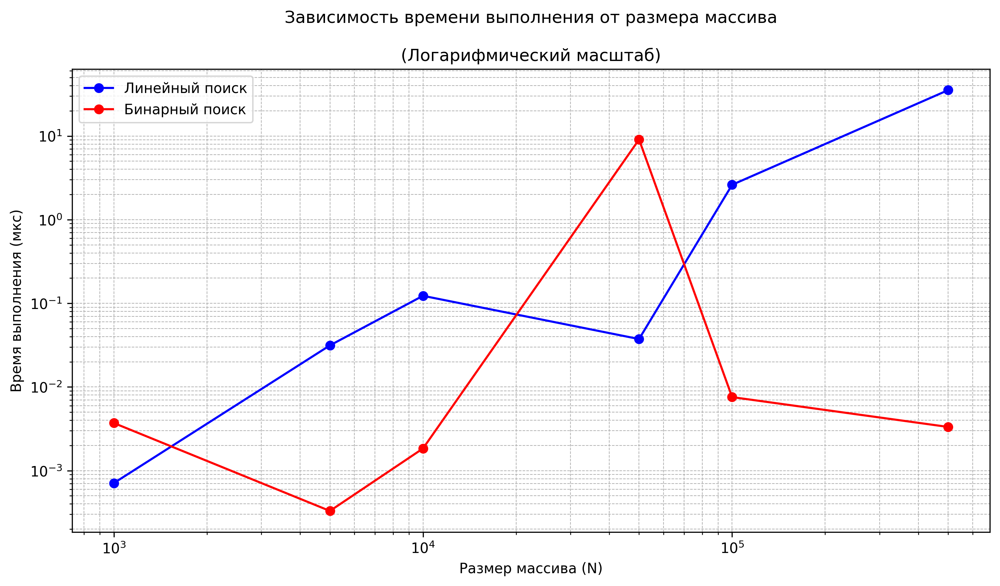

# Отчёт к лабораторной работе 1
# Введение в алгоритмы. Сложность. Поиск.
**Дата:** 2025-10-08

**Семестр:** 3 курс 5 семестр

**Группа:** ПИЖ-б-о-23-2(1) 

**Дисциплина:** Анализ сложности алгоритмов 

**Студент:** Торубаров Максим Евгеньевич

## Цель работы
Освоить понятие вычислительной сложности алгоритма. Получить практические навыки реализации и анализа линейного и бинарного поиска. Научиться экспериментально подтверждать теоретические оценки сложности O(n) и O(log n)

## Выполненные задачи
* Задача 1: Реализовать функцию линейного поиска элемента в массиве.
* Задача 2: Реализовать функцию бинарного поиска элемента в отсортированном массиве.
* Задача 3: Провести теоретический анализ сложности обоих алгоритмов.
* Задача 4: Экспериментально сравнить время выполнения алгоритмов на массивах разного размера.
* Задача 5: Визуализировать результаты, подтвердив асимптотику O(n) и O(log n).

## Листинг кода
```py
search_comparision.py
import timeit
import matplotlib.pyplot as plt
import random


def linear_search(arr, target):
    """Алгоритм линейного поиска"""
    for i in arr:  # O(n)
        if i == target:  # O(1)
            return True  # O(1)
    return False  # O(1)
    # Общая сложность O(n)


def binary_search(arr, target):
    """Алгоритм бинарного поиска"""
    while len(arr) > 1:  # O(log n)
        mid = arr[len(arr) // 2]  # O(1)
        if mid == target:  # O(1)
            return True  # O(1)
        elif mid < target:  # O(1)
            arr = arr[:mid]  # O(1)
        else:  # O(1)
            arr = arr[mid:]  # o(1)
    return False  # O(1)
    # Общая сложность O(log n)


def timer(arr, target):
    """Функция для замера времени выполнения"""
    global times_linear
    global times_binary

    # Для линейного поиска
    execution_time_linear = (
        timeit.timeit(
            lambda: linear_search(arr, target), number=10) * 1000 / 10
    )
    times_linear.append(execution_time_linear)

    # Для бинарного поиска
    execution_time_binary = (
        timeit.timeit(
            lambda: binary_search(arr, target), number=10) * 1000 / 10
    )
    times_binary.append(execution_time_binary)

    print(
        "{:>10} {:>30.4f} {:>30.4f}".format(
            len(arr), execution_time_linear, execution_time_binary
        )
    )


# Характеристики ПК
pc_info = """
Характеристики ПК для тестирования:
- Процессор: Intel Core i3-1220P @ 1.5GHz
- Оперативная память: 8 GB DDR4
- ОС: Windows 11
- Python: 3.12.10
"""
print(pc_info)


sizes = [1000, 5000, 10000, 50000, 100000, 500000]
arrs = []
times_linear = []
times_binary = []

# Создание отсортированных массивов
for size in sizes:
    arr = []
    for i in range(size):
        arr.append(random.randint(0, 1000))
    arr.sort()
    arrs.append([arr])

# Выбор целевого элемента
arrs[0].append(arrs[0][0][0])  # Первый элемент
arrs[1].append(arrs[1][0][len(arrs[1][0]) // 2])  # Средний элемент
arrs[2].append(arrs[2][0][-1])  # Последний элемент
arrs[3].append(random.randint(0, arrs[3][0][-1]))  # Случайный элемент
arrs[4].append(1001)  # Не существует
arrs[5].append(random.randint(0, arrs[3][0][-1]))  # Случайный элемент

print("Замеры времени выполнения для алгоритмов поиска:")
print(
    "{:>10} {:>30} {:>30}".format(
        "Размер (N)", "Время (мкс) - Линейный поиск",
        "Время (мкс) - Бинарный поиск"
    )
)

# Замеры времени выполнения
for arr in arrs:
    timer(arr[0], arr[1])

# График в обычном масштабе
plt.figure(figsize=(10, 6))
plt.plot(sizes, times_linear, "bo-", label="Линейный поиск")
plt.plot(sizes, times_binary, "ro-", label="Бинарный поиск")
plt.xlabel("Размер массива (N)")
plt.ylabel("Время выполнения (мкс)")
plt.title("""Зависимость времени выполнения от размера массива
          \n(Обычный масштаб)""")
plt.grid(True, which="both", linestyle="--", linewidth=0.5)
plt.legend()
plt.tight_layout()
plt.savefig("time_complexity_plot_linear.png", dpi=300, bbox_inches="tight")
plt.show()

# График в логарифмическом масштабе
plt.figure(figsize=(10, 6))
plt.plot(sizes, times_linear, "bo-", label="Линейный поиск")
plt.plot(sizes, times_binary, "ro-", label="Бинарный поиск")
plt.xlabel("Размер массива (N)")
plt.ylabel("Время выполнения (мкс)")
plt.title("""Зависимость времени выполнения от размера массива
          \n(Логарифмический масштаб)""")
plt.grid(True, which="both", linestyle="--", linewidth=0.5)
plt.xscale("log")  # Логарифмический масштаб по X
plt.yscale("log")  # Логарифмический масштаб по Y
plt.legend()
plt.tight_layout()
plt.savefig("time_complexity_plot_log.png", dpi=300, bbox_inches="tight")
plt.show()

```




**Линейный поиск:** теоретически O(n), время растет линейно с размером массива. Практически: на обычном масштабе виден явный линейный рост времени выполнения от 0 до 35 мкс при увеличении N от 0 до 500000. В логарифмическом масштабе график показывает почти линейный рост, что характерно для линейной сложности O(n) в лог-масштабе. Время поиска зависит от позиции элемента - для первого элемента минимально, для последнего/отсутствующего максимально.

**Бинарный поиск:** теоретически O(log n), время растет логарифмически. Практически: на обычном масштабе время остается практически постоянным (около 0-10 мкс) даже при увеличении N до 500000. В логарифмическом масштабе график показывает скачки и нестабильное поведение, но в целом остается в области низких значений времени выполнения. Это объясняется тем, что логарифмическая функция растет очень медленно, и небольшие вариации времени выполнения становятся более заметными в лог-масштабе. Время почти не зависит от позиции искомого элемента, так как для любого элемента требуется примерно log₂(n) сравнений.

## Контрольные вопросы
### 1. Что такое асимптотическая сложность алгоритма и зачем она нужна?
Асимптотическая сложность — это оценка роста времени выполнения или потребления памяти алгоритма при неограниченном увеличении объема входных данных. Она нужна для теоретического сравнения алгоритмов, позволяя предсказать, какой из них будет эффективнее на больших данных, без привязки к конкретному "железу" или необходимости проводить exhaustive-тестирование.

### 2. Разница между O(1), O(n) и O(log n) с примерами
*   **O(1) — постоянная сложность:** Время выполнения не зависит от размера данных. *Пример: получение элемента массива по индексу.*
*   **O(n) — линейная сложность:** Время выполнения прямо пропорционально размеру данных. *Пример: поиск элемента в неотсортированном списке перебором.*
*   **O(log n) — логарифмическая сложность:** Время растет очень медленно, так как на каждом шаге объем обрабатываемых данных уменьшается вдвое (или в другое количество раз). *Пример: бинарный поиск в отсортированном массиве.*

### 3. Отличие линейного поиска от бинарного и условия выполнения бинарного поиска
**Главное отличие** — в стратегии и эффективности. Линейный поиск последовательно проверяет все элементы (O(n)), а бинарный поиск на каждом шаге отбрасывает половину оставшихся данных (O(log n)).

**Условия для применения бинарного поиска:**
1.  Массив должен быть **отсортирован**.
2.  Должна быть обеспечена **возможность прямого доступа к любому элементу** (по индексу), что исключает структуры данных вроде связных списков.

### 4. Почему практическое время выполнения может отличаться от O-большого
O-большое описывает тренд роста на бесконечно больших данных, игнорируя:
*   **Константы и множители:** "Медленная" операция O(1) может на практике быть дороже "быстрой" O(n) при небольших `n`.
*   **Аппаратные особенности:** Скорость кэша процессора, объем оперативной памяти.
*   **Влияние окружения:** Фоновые процессы операционной системы.
*   **Характер входных данных:** Алгоритм может иметь разную производительность в лучшем, среднем и худшем случае, а O-нотация часто описывает именно худший или усредненный сценарий.

### 5. Как экспериментально подтвердить, что сложность равна O(n) или O(log n)
Чтобы подтвердить сложность экспериментально, нужно:
1.  **Провести замеры:** Измерить время выполнения алгоритма на наборах данных разного размера (например, от 1000 до 1 000 000 элементов).
2.  **Построить график:** Отобразить зависимость времени от размера данных.
3.  **Проанализировать тренд:**
    *   Если график **близок к прямой линии** — это подтверждает линейную сложность **O(n)**.
    *   Если график **демонстрирует замедление роста и похож на логарифмическую кривую** (что особенно наглядно видно в логарифмическом масштабе) — это подтверждает сложность **O(log n)**.
